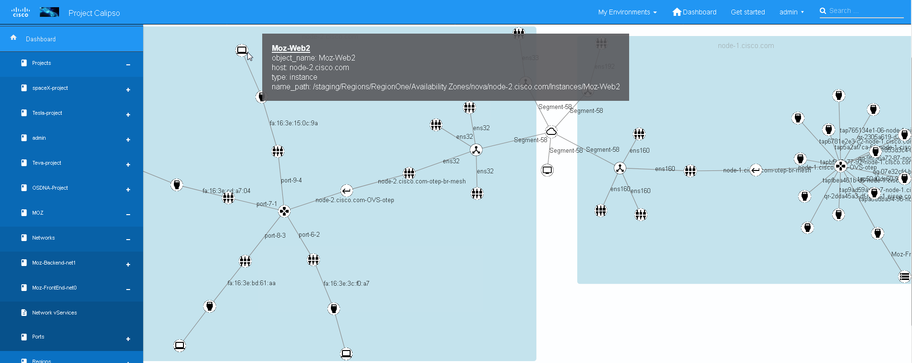
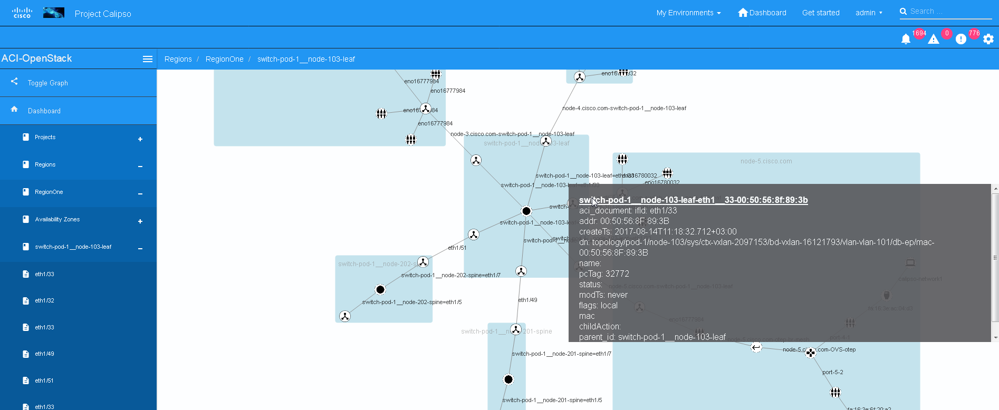
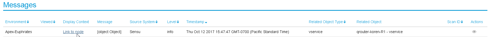
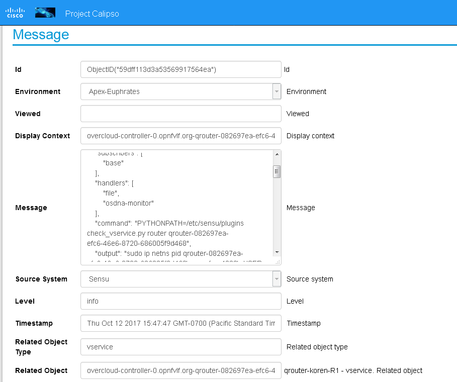
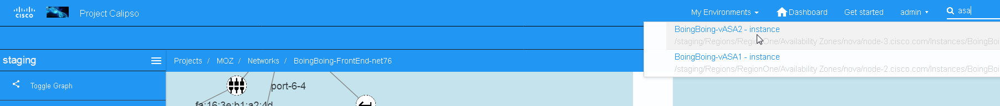
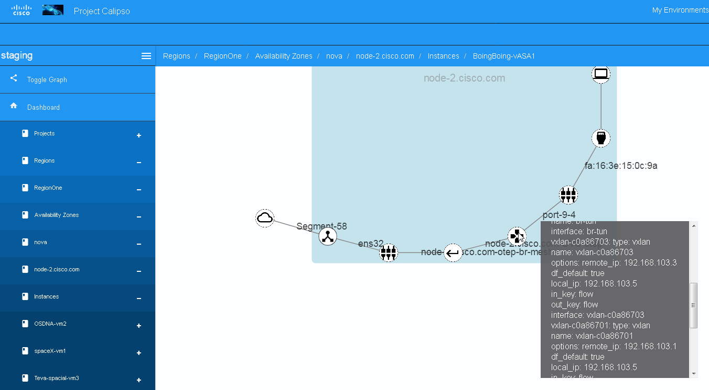
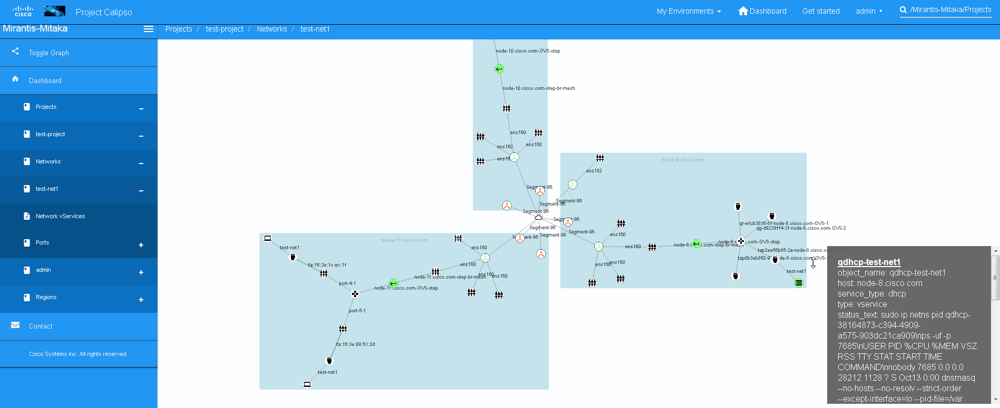

***The following are fake stories, although providing real examples of
real problems that are faced today by cloud providers, and showing
possible resolutions provided by Calipso:***

***Enterprise use-case story (Calipso ‘S’ release):***

Moz is a website publishing and managing product, Moz provides
reputation and popularity tracking, helps with distributions, listing,
and ratings and provides content distributions for industry marketing.

Moz considers moving their main content distribution application to be
hosted on https://www.dreamhost.com/, which provides shared and
dedicated IaaS and PaaS hosting based on OpenStack.

As a major milestone for Moz’s due diligence for choosing Dreamhost, Moz
acquires a shared hosting facility from Dreamhost, that is
cost-effective and stable, it includes 4 mid-sized Web-servers, 4
large-sized Application-servers and 2 large-sized DB servers, connected
using several networks, with some security services.

Dreamhost executives instruct their infrastructure operations department
to make sure proper SLA and Monitoring is in-place so the due diligence
and final production deployment of Moz’s services in the Dreamhost
datacenter goes well and that Moz’s engineers receive excellent service
experience.

Moz received the following SLA with their current VPS contract:

-  97-day money back guarantee, in case of a single service down event
   or any dissatisfaction.

-  99.5 % uptime/availability with a weekly total downtime of 30
   minutes.

-  24/7/365 on-call service with a total of 6 hours MTTR.

-  Full HA for all networking services.

-  Managed VPS using own Control Panel IaaS provisioning with overall
   health visibility.

-  Scalable RAM, starts with 1GB can grow per request to 16GB from
   within control panel.

-  Guaranteed usage of SSD or equivalent speeds, storage capacity from
   30GB to 240GB.

-  Backup service based on cinder-backup and Ceph’s dedicated backup
   volumes, with restoration time below 4 hours.

Dreamhost‘s operations factored all requirement and has decided to
include real-time monitoring and analysis for the VPS for Moz.

One of the tools used now for Moz environment in Dreamhost is Calipso
for virtual networking.

Here are some benefits provided by Calipso for Dreamhost operations
during service cycles:

*Reporting:*

Special handling of virtual networking is in place:

-  Dreamhost designed a certain virtual networking setup and
   connectivity that provides the HA and performance required by the SLA
   and decided on several physical locations for Moz’s virtual servers
   in different availability zones.

-  Scheduling of discovery has been created, Calipso takes a snapshot of
   Moz’s environment every Sunday at midnight, reporting on connectivity
   among all 20 servers (10 main and 10 backups) and overall health of
   that connectivity.

-  Every Sunday morning at 8am, before the week’s automatic
   snapshotting, the NOC administrator runs a manual discovery and saves
   that snapshot, she then runs a comparison check against last week’s
   snapshot and against initial design to find any gaps or changes that
   might happen due to other shared services deployments, virtual
   instances and their connectivity are analyzed and reported with
   Calipso’s topology and health monitoring.

-  Reports are saved for a bi-weekly reporting sent to Moz’s networking
   engineers.

    *Change management:*

    If infrastructure changes needs to happen on any virtual service
    (routers, switches, firewalls etc.) or on any physical server or
    physical switch the following special guidelines apply:

-  Run a search on Calipso for the name of the virtual service, switch
   or host. Lookup if Moz environment is using this object (using the
   object’s attributes).

-  Using Calipso’s impact analysis, fill a report stating all Moz’s
   objects, on which host, connected to which switch that is affected by
   the planed change.

-  Run clique-type scan, using the specific object as ‘focal-point’ to
   create a dedicated topology with accompanied health report before
   conducting the change itself, use this a *pre snapshot*.

-  Simulate the change, using Moz’s testing environment only, make sure
   HA services are in places and downtime is confirmed to be in the SLA
   boundaries.

-  Using all reports provided by Calipso, along with application and
   storage reports, send a detailed change request to NOC and later to
   the end-customer for review.

-  During the change, make sure HA is operational, by running the same
   clique-type snapshotting every 10 minutes and running a comparison.

-  NOC, while waiting for the change to complete, looks at Calipso’s
   dashboard focused on MOZ’s environment, monitoring results for
   service down event (as expected), impact on other objects in the
   service chain - the entire Calipso clique for that object (as
   expected).

-  Once operations has reported back to NOC about change done, run the
   same snapshotting again as *post snapshot* and run a comparison to
   make sure all virtual networking are back to the ‘as designed’ stage
   and all networking services are back.

**Example snapshot taken at one stage on Calipso for the Moz virtual
networking:**

|image0|

    *Troubleshooting:*

    Dreamhost NOC uses Calipso dashboards for Moz’s environment for
    their daily health-check. Troubleshooting starts in two cases:

1. When a failure is detected on Calipso for any of Moz’s objects on
   their virtual networking topologies,

2. When a service case has been opened by Moz with “High Priority,
   service down” flag.

3. Networking department needs to know which virtual services are
   connected to which ACI switches ports.

    The following actions are taken, using Calipso dashboards:

-  Kickoff a discovery through Calipso API for all objects related to
   Moz.

-  For a service request with no Calipso error detected: using Calipso’s
   impact analysis, create all cliques for all objects as focal point.

-  For an error detected by Calipso: using Calipso’s impact analysis,
   create cliques for objects with errors as focal point.

-  Resulted cliques are then analyzed using detailed messaging facility
   in Calipso (looking deeply into any message generated regarding the
   related objects).

-  Report with ACI ports to virtual services mappings is sent to
   networking department for further analysis.

   |image1|

-  If this is a failure on any physical device (host or switch) and/or
   on any physical NIC (switch or host side), Calipso immediately points
   this out and using the specific set of messages generated the
   administrator can figure out the root cause (like optical failure,
   driver, disconnect etc.).

-  In virtual object failures Calipso saves time pinpointing the servers
   where erroneous objects are running, and their previous and new
   connectivity details.

-  Calipso alerts on dependencies for :

1. All related objects in the clique for that objects.

2. Related hosts

3. Related projects and networks

4. Related application (\* in case Murano app has been added)

-  Administrators connects directly to the specific servers and now,
   using the specific object attributes can start he’s manual
   troubleshooting (actual fixing of the software issues is not
   currently part of the Calipso features).

-  The NOC operators approves closing the service ticket only when all
   related Calipso cliques are showing up as healthy and connectivity is
   back to it’s original “as designed” stage, using Calipso older
   snapshots.

**Lookup of message – to – graph object in messaging facility:**

|image2|

**Finding the right object related to a specific logging/monitoring
message**:

|image3|

***Service Provider use-case story (Calipso ‘P’ release):***

BoingBoing is a specialized video casting service and blogging site. It
is using several locations to run their service (regional hubs and
central corporate campus, some hosted and some are private).

BoingBoing contracted AT&T to build an NFV service for them, deployed on
2 new hosted regional hubs, to be brought up dynamically for special
sporting, news or cloture events. On each one of the 2 hosted virtual
environments the following service chain is created:

1. Two vyatta 5600 virtual routers are front-end routing aggregation
   function.

2. Two Steelhead virtual wan acceleration appliances connected to
   central campus for accelerating and caching of video casting
   services.

3. Two f5 BIG-IP Traffic Management (load balancing) virtual appliances.

4. Two Cisco vASA for virtual firewall and remote-access VPN services.

As a major milestone for BoingBoing’s due diligence for choosing AT&T
NFV service, BoingBoing acquires 2 shared hosting facilities and
automatic service from AT&T, that is cost-effective and stable, it
includes This NFV service consist of a total of 16 virtual appliance
across those 2 sites, to be created on-demand and maintained with a
certain SLA once provisioned, all NFV devices are connected using
several networks, provisioned using VPP ml2 on an OpenStack based
environment..

AT&T executives instruct their infrastructure operations department to
make sure proper SLA and Monitoring is in-place so the due diligence and
final production deployment of BoingBoing’s services in the AT&T
datacenters goes well and that BoingBoing’s engineers receive excellent
service experience.

BoingBoing received the following SLA with their current VPS contract:

-  30-day money back guarantee, in case of a single service down event
   or any dissatisfaction.

-  99.9 % uptime/availability with a weekly total downtime of 10
   minutes.

-  24/7/365 on-call service with a total of 2 hours MTTR.

-  Full HA for all networking services.

-  Managed service using Control Panel IaaS provisioning with overall
   health visibility.

-  Dedicated RAM, from16GB to 64GB from within control panel.

-  Guaranteed usage of SSD or equivalent speeds, storage capacity from
   10GB to 80GB.

-  Backup service based on cinder-backup and Ceph’s dedicated backup
   volumes, with restoration time below 4 hours.

-  End-to-end throughput from central campus to dynamically created
   regional sites to be always above 2Gbps, including all devices on the
   service chain and the virtual networking in place.

AT&T’s operations factored all requirement and has decided to include
real-time monitoring and analysis for the NFV environment for
BoingBoing.

One of the tools used now for BoingBoing environment in AT&T is Calipso
for virtual networking.

Here are some benefits provided by Calipso for AT&T operations during
service cycles:

*Reporting:*

Special handling of virtual networking is in place:

-  AT&T designed a certain virtual networking (SFC) setup and
   connectivity that provides the HA and performance required by the SLA
   and decided on several physical locations for BoingBoing’s virtual
   appliances in different availability zones.

-  Scheduling of discovery has been created, Calipso takes a snapshot of
   BoingBoing’s environment every Sunday at midnight, reporting on
   connectivity among all 16 instances (8 per regional site, 4 pairs on
   each) and overall health of that connectivity.

-  Every Sunday morning at 8am, before the week’s automatic
   snapshotting, the NOC administrator runs a manual discovery and saves
   that snapshot, she then runs a comparison check against last week’s
   snapshot and against initial design to find any gaps or changes that
   might happen due to other shared services deployments, virtual
   instances and their connectivity are analyzed and reported with
   Calipso’s topology and health monitoring.

-  Reports are saved for a bi-weekly reporting sent to BoingBoing’s
   networking engineers.

-  Throughput is measured by a special traffic sampling technology
   inside the VPP virtual switches and sent back to Calipso for
   references to virtual objects and topological inventory. Dependencies
   are analyzed so SFC topologies are now visualized across all sites
   and includes graphing facility on the Calipso UI to visualize the
   throughput.

    *Change management:*

    If infrastructure changes needs to happen on any virtual service
    (NFV virtual appliances, internal routers, switches, firewalls etc.)
    or on any physical server or physical switch the following special
    guidelines apply:

-  Run a lookup on Calipso search-engine for the name of the virtual
   service, switch or host, including names of NFV appliances as updated
   in the Calipso inventory by the NFV provisioning application. Lookup
   if BoingBoing environment is using this object (using the object’s
   attributes).

   **Running a lookup on Calipso search-engine**

|image4|

-  Using Calipso’s impact analysis, fill a report stating all
   BoingBoing’s objects, on which host, connected to which switch that
   is affected by the planed change.

-  Run clique-type scan, using the specific object as ‘focal-point’ to
   create a dedicated topology with accompanied health report before
   conducting the change itself, use this a *pre snapshot*.

-  Simulate the change, using BoingBoing’s testing environment only,
   make sure HA services are in places and downtime is confirmed to be
   in the SLA boundaries.

-  Using all reports provided by Calipso, along with application and
   storage reports, send a detailed change request to NOC and later to
   the end-customer for review.

-  During the change, make sure HA is operational, by running the same
   clique-type snapshotting every 10 minutes and running a comparison.

-  NOC, while waiting for the change to complete, looks at Calipso’s
   dashboard focused on BoingBoing’s environment, monitoring results for
   SFC service down event (as expected), impact on other objects in the
   service chain - the entire Calipso clique for that object (as
   expected).

-  Once operations has reported back to NOC about change done, run the
   same snapshotting again as *post snapshot* and run a comparison to
   make sure all virtual networking are back to the ‘as designed’ stage
   and all networking services are back.

**Example snapshot taken at one stage for the BoingBoing virtual
networking and SFC:**

|image5|

    *Troubleshooting:*

    AT&T NOC uses Calipso dashboards for BoingBoing’s environment for
    their daily health-check. Troubleshooting starts in two cases:

1. When a failure is detected on Calipso for any of BoingBoing’s objects
   on their virtual networking topologies,

2. When a service case has been opened by BoingBoing with “High
   Priority, SFC down” flag.

    The following actions are taken, using Calipso dashboards:

-  Kickoff a discovery through Calipso API for all objects related to
   BoingBoing.

-  For a service request with no Calipso error detected: using Calipso’s
   impact analysis, create all cliques for all objects as focal point.

-  For an error detected by Calipso: using Calipso’s impact analysis,
   create cliques for objects with errors as focal point.

-  Resulted cliques are then analyzed using detailed messaging facility
   in Calipso (looking deeply into any message generated regarding the
   related objects).

-  If this is a failure on any physical device (host or switch) and/or
   on any physical NIC (switch or host side), Calipso immediately points
   this out and using the specific set of messages generated the
   administrator can figure out the root cause (like optical failure,
   driver, disconnect etc.).

-  In virtual object failures Calipso saves time pinpointing the servers
   where erroneous objects are running, and their previous and new
   connectivity details.

-  \*Sources of alerts ...OpenStack, Calipso’s and Sensu are built-in
   sources, other NFV related monitoring and alerting sources can be
   added to Calipso messaging system.

-  Calipso alerts on dependencies for :

1. All related objects in the clique for that objects.

2. Related hosts

3. Related projects and networks

4. Related NFV service and SFC (\* in case NFV tacker has been added)

-  Administrators connects directly to the specific servers and now,
   using the specific object attributes can start he’s manual
   troubleshooting (actual fixing of the software issues is not
   currently part of the Calipso features).

-  The NOC operators approves closing the service ticket only when all
   related Calipso cliques are showing up as healthy and connectivity is
   back to it’s original “as designed” stage, using Calipso older
   snapshots.

**Calipso’s monitoring dashboard shows virtual services are back to
operational state:**

|image6|

