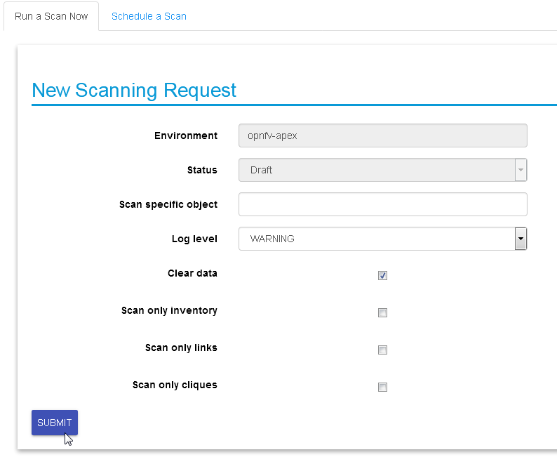

###############################################################################
# Copyright (c) 2017 Koren Lev (Cisco Systems), Yaron Yogev (Cisco Systems)   #
# and others                                                                  #
#                                                                             #
# All rights reserved. This program and the accompanying materials            #
# are made available under the terms of the Apache License, Version 2.0       #
# which accompanies this distribution, and is available at                    #
# http://www.apache.org/licenses/LICENSE-2.0                                  #
###############################################################################
| Calipso.io
| Administration Guide

|image0|

Project “Calipso” tries to illuminate complex virtual networking with
real time operational state visibility for large and highly distributed
Virtual Infrastructure Management (VIM).

Calipso provides visible insights using smart discovery and virtual
topological representation in graphs, with monitoring per object in the
graph inventory to reduce error vectors and troubleshooting, maintenance
cycles for VIM operators and administrators.

Calipso model, described in this document, was *built for
multi-environment and many VIM variances*, the model was tested
successfully (as of Aug 27\ :sup:`th`) against 60 different VIM
variances (Distributions, Versions, Networking Drivers and Types).

Table of Contents

Calipso.io Administration Guide 1

1 Environments config 3

2 UI overview 5

2.1 User management 7

2.2 Logging in and out 8

2.3 Messaging check 9

2.4 Adding a new environment 9

3 Preparing an environment for scanning 10

3.1 Where to deploy Calipso application 10

3.2 Environment setup 10

3.3 Filling the environment config data 11

3.4 Testing the connections 11

4 Links and Cliques 12

4.1 Adding environment clique\_types 13

5 Environment scanning 14

5.1 UI scanning request 14

5.2 UI scan schedule request 16

5.3 API scanning request 17

5.4 CLI scanning in the calipso-scan container 18

5.4.1 Clique Scanning 19

5.4.2 Viewing results 20

6 Editing or deleting environments 20

7 Event-based scanning 21

7.1 Enabling event-based scanning 21

7.2 Event-based handling details 22

8 ACI scanning 34

9 Monitoring enablement 36

10 Modules data flows 38

Environments config
===================

    Environment is defined as a certain type of Virtual Infrastructure
    facility the runs under a single unified Management (like an
    OpenStack facility).

    Everything in Calipso application rely on environments config, this
    is maintained in the **“environments\_config”** collection in the
    mongo Calipso DB.

    Environment configs are pushed down to Calipso DB either through UI
    or API (and only in OPNFV case Calipso provides an automated program
    to build all needed environments\_config parameters for an ‘Apex’
    distribution automatically).

    When scanning and discovering items Calipso uses this configuration
    document for successful scanning results, here is an example of an
    environment config document:

    **{ **

    **"name": "DEMO-ENVIRONMENT-SCHEME", **

    **"enable\_monitoring": true, **

    **"last\_scanned": "filled-by-scanning", **

    **"app\_path": "/home/scan/calipso\_prod/app", **

    **"type": "environment", **

    **"distribution": "Mirantis", **

    **"distribution\_version": "8.0”, **

    **"mechanism\_drivers": ["OVS”], **

    **"type\_drivers": "vxlan"**

    **"operational": "stopped", **

    **"listen": true, **

    **"scanned": false, **

    **"configuration": [**

    **{**

    **"name": "OpenStack", **

    **"port":”5000”, **

    **"user": "adminuser", **

    **"pwd": "dummy\_pwd", **

    **"host": "10.0.0.1", **

    **"admin\_token": "dummy\_token"**

    **}, **

    **{**

    **"name": "mysql", **

    **"pwd": "dummy\_pwd", **

    **"host": "10.0.0.1", **

    **"port": “3307”, **

    **"user": "mysqluser"**

    **}, **

    **{**

    **"name": "CLI", **

    **"user": "sshuser", **

    **"host": "10.0.0.1", **

    **"pwd": "dummy\_pwd"**

    **}, **

    **{**

    **"name": "AMQP", **

    **"pwd": "dummy\_pwd", **

    **"host": "10.0.0.1", **

    **"port": “5673”, **

    **"user": "rabbitmquser"**

    **}, **

    **{**

    **"name": "Monitoring", **

    **"ssh\_user": "root", **

    **"server\_ip": "10.0.0.1", **

    **"ssh\_password": "dummy\_pwd", **

    **"rabbitmq\_pass": "dummy\_pwd", **

    **"rabbitmq\_user": "sensu", **

    **"rabbitmq\_port": “5671”, **

    **"provision": "None", **

    **"env\_type": "production", **

    **"ssh\_port": “20022”, **

    **"config\_folder": "/local\_dir/sensu\_config", **

    **"server\_name": "sensu\_server", **

    **"type": "Sensu", **

    **"api\_port": NumberInt(4567)**

    **}, **

    **{**

    **"name": "ACI", **

    **"user": "admin", **

    **"host": "10.1.1.104", **

    **"pwd": "dummy\_pwd"**

    **}**

    **], **

    **"user": "wNLeBJxNDyw8G7Ssg", **

    **"auth": {**

    **"view-env": [**

    **"wNLeBJxNDyw8G7Ssg"**

    **], **

    **"edit-env": [**

    **"wNLeBJxNDyw8G7Ssg"**

    **]**

    **}, **

    **}**

    Here is a brief explanation of the purpose of major keys in this
    environment configuration doc:

    **Distribution**: captures type of VIM, used for scanning of
    objects, links and cliques.

    **Distribution\_version**: captures version of VIM distribution,
    used for scanning of objects, links and cliques.

    **Mechanism\_driver**: captures virtual switch type used by the VIM,
    used for scanning of objects, links and cliques.

    **Type\_driver**: captures virtual switch tunneling type used by the
    switch, used for scanning of objects, links and cliques.

    **Listen**: defines whether or not to use Calipso listener against
    the VIM BUS for updating inventory in real-time from VIM events.

    **Scanned**: defines whether or not Calipso ran a full and a
    successful scan against this environment.

    **Last\_scanned**: end time of last scan.

    **Operational**: defines whether or not VIM environment endpoints
    are up and running.

    **Enable\_monitoring**: defines whether or not Calipso should deploy
    monitoring of the inventory objects running inside all environment
    hosts.

    **Configuration-OpenStack**: defines credentials for OpenStack API
    endpoints access.

    **Configuration-mysql**: defines credentials for OpenStack DB
    access.

    **Configuration-CLI**: defines credentials for servers CLI access.

    **Configuration-AMQP**: defines credentials for OpenStack BUS
    access.

    **Configuration-Monitoring**: defines credentials and setup for
    Calipso sensu server (see monitoring-guide for details).

    **Configuration-ACI**: defines credentials for ACI switched
    management API, if exists.

    **User and auth**: used for UI authorizations to view and edit this
    environment.

    **App-path**: defines the root directory of the scanning
    application.

    \* This guide will help you understand how-to add new environment
    through the provided Calispo UI module and then how-to use this
    environment (and potentially many others) for scanning and real-time
    inventories collection.

UI overview 
============

    Cloud administrator can use the Calipso UI for he’s daily tasks.
    Once Calipso containers are running (see quickstart-guide) the UI
    will be available at:

    http://server-ip:80 , default login credentials: admin/123456.

    Before logging in, while at the main landing page, a generic
    information is provided.

    Post login, at the main dashboard you can click on “Get started” and
    view a short guide for using some of the basic UI functions,
    available at:
    `server-ip/getstarted <http://korlev-calipso-dev.cisco.com/getstarted>`__.

    The main areas of interest are shown in the following screenshot:

    *Main areas on UI:*

    |image1|

    *Main areas details:*

    **Navigation Tree(1):** Hierarchy searching through the inventory
    using objects and parents details, to lookup a focal point of
    interest for graphing or data gathering.

    **Main functions (2):** Jumping between highest level dashboard (all
    environments), specific environment and some generic help is
    provided in this area.

    **Environment Summary (3):** The central area where the data is
    exposed, either through graph or through widget-attribute-listing.

    **Search engine (4):** Finding interesting focal points faster
    through basic object naming lookups, then clicking on results to get
    transferred directly to that specific object dashboard. Searches are
    conducted across all environments.

    **More settings (5):** In this area the main collections of data are
    exposed, like scans, schedules, messaging, clique\_types,
    link\_types and others.

    **Graph or Data toggle (6):** When focusing on a certain focal
    point, this button allows changing from a graph-view to simple
    data-view per request, if no graph is available for a certain object
    the data-view is used by default, if information is missing try this
    button first to make sure the correct view is chosen.

User management
---------------

    The first place an administrator might use is the user’s
    configurations, this is where a basic RBAC is provided for
    authorizing access to the UI functions. Use the ‘settings’ button
    and choose ‘users’ to access:

    |image2|

    Editing the admin user password is allowed here:

|image3|

    Note:

    The ‘admin’ user is allowed all functions on all environments, you
    shouldn’t change this behavior and you should never delete this
    user, or you’ll need re-install Calipso.

    Adding new user is provided when clicking the “Create new user”
    option:

    *Creating a new user:*

|image4|

    Before environments are configured there is not a lot of options
    here, once environments are defined (one or more), users can be
    allowed to edit or view-only those environments.

 Logging in and out
-------------------

    To logout and re-login with different user credentials you can click
    the username option and choose to sign out:

    |image5|

Messaging check
---------------

    When calispo-scan and calipso-listen containers are running, they
    provide basic messages on their processes status, this should be
    exposed thorough the messaging system up to the UI, to validate this
    choose ‘messages’ from the settings button:

|image6|

Adding a new environment
------------------------

    As explained above, environment configuration is the pre requisite
    for any Calipso data gathering, goto “My Environments” -> and “Add
    new Environment” to start building the environment configuration
    scheme:

|image7|

Note: this is automated with OPNFV apex distro, where Calipso
auto-discovers all credentials

Preparing an environment for scanning
=====================================

    Some preparation is needed for allowing Calipso to successfully
    gather data from the underlying systems running in the virtual
    infrastructure environment. This chapter explain the basic
    requirements and provide recommendations.

Where to deploy Calipso application
-----------------------------------

    Calipso application replaces the manual discovery steps typically
    done by the administrator on every maintenance and troubleshooting
    cycles, It needs to have the administrators privileges and is most
    accurate when placed on one of the controllers or a“jump server”
    deployed as part of the cloud virtual infrastructure, Calipso calls
    this server a “Master host”.

    Consider Calipso as yet another cloud infrastructure module, similar
    to neutron, nova.

    Per supported distributions we recommend installing the Calipso
    application at:

1. Mirantis: on the ‘Fuel’ or ‘MCP’ server.

2. RDO/Packstack: where the ansible playbooks are deployed.

3. Canonical/Ubuntu: on the juju server.

4. Triple-O/Apex: on the jump host server.

Environment setup
-----------------

    The following steps should be taken to enable Calispo’s scanner and
    listener to connect to the environment controllers and compute
    hosts:

1. OpenStack API endpoints : Remote access user accessible from the
   master host with the required credentials and allows typical ports:
   5000, 35357, 8777, 8773, 8774, 8775, 9696

2. OpenStack DB (MariaDB or MySQL): Remote access user accessible from
   the master host to ports 3306 or 3307 allowed access to all Databases
   as read-only.

3. Master host SSH access: Remote access user with sudo privileges
   accessible from the master host through either user/pass or rsa keys,
   the master host itself should then be allowed access using rsa-keys
   (password-less) to all other infrastructure hosts, all allowing to
   run sudo CLI commands over tty, when commands entered from the master
   host source itself.

4. AMQP message BUS (like Rabbitmq): allowed remote access from the
   master host to listen for all events generated using a guest account
   with a password.

5. Physical switch controller (like ACI): admin user/pass accessed from
   master host.

    *Note: The current lack of operational toolsets like Calipso forces
    the use of the above scanning methods, the purpose of Calipso is to
    deploy its scanning engine as an agent on all environment hosts, in
    such scenario the requirements above might be deprecated and the
    scanning itself can be made more efficient.*

Filling the environment config data
-----------------------------------

    As explained in chapter 1 above, environment configuration is the
    pre requisite and all data required is modeled as described. See
    api-guide for details on submitting those details through calispo
    api module. When using the UI module, follow the sections tabs and
    fill the needed data per help messages and the explanations in
    chapter 1.

    Only the AMQP, Monitoring and ACI sections in environment\_config
    documents are optional, per the requirements detailed below on this
    guide.

Testing the connections
-----------------------

    Before submitting the environment\_config document it is wise to
    test the connections. Each section tab in the environment
    configuration has an optional butting for testing the connection
    tagged “test connection”. When this button is clicked, a check is
    made to make sure all needed data is entered correctly, then a
    request is sent down to mongoDB to the “connection\_tests”
    collection. Then the calispo scanning module will make the required
    test and will push back a response message alerting whether or not
    this connection is possible with the provided details and
    credentials.

    *Test connection per configuration section:*

|image8|

    With the above tool, the administrator can be assured that Calipso
    scanning will be successful and the results will be an accurate
    representation of the state of he’s live environment.

Links and Cliques 
==================

    A very powerful capability in Calipso allows it to be very adaptive
    and support many variances of VIM environments, this capability lies
    in its objects, links and cliques models enabling the scanning of
    data and analysis of inter-connections and creation of many types of
    topology graphs..

    Please refer to calipso-model document for more details.

    The UI allows viewing and editing of Link types and Clique types
    through the settings options:

    *Link types:*

|image9|

    Note:

    We currently recommend not to add nor edit the Link types pre-built
    in Calipso’s latest release (allowed only for the ‘admin’ user), as
    it is tested and proven to support more than 60 popular VIM
    variances.

    An administrator might choose to define several environment specific
    **Clique types** for creating favorite graphs using the focal\_point
    objects and link\_types lists already built-in:

 Adding environment clique\_types 
----------------------------------

    Use either the API or the UI to define specific environment
    clique\_types.

    For adding clique\_types, use settings menu and choose “Create new
    clique type” option, then provide a specific environment name (per
    previous environment configurations), define a focal\_point (like:
    instance, or other object types) and a list of resulted link\_types
    to include in the final topology graph. Refer to calipso-model
    document for more details.

    Clique\_types are needed for accurate graph buildup, before sending
    a scan request.

    Several defaults are provided with each new Calipso release.

    *Clique types:*

|image10|

    Note: ask calipso developers for recommended clique\_types
    (pre-built in several Calipso deployments), per distribution
    variance, fully tested by Calipso developers:

Environment scanning
====================

    Once environment is setup correctly, environment\_config data is
    filled and tested, scanning can start. This is can be done with the
    following four options:

1. UI scanning request

2. UI scan schedule request

3. API scanning or scheduling request.

4. CLI scanning in the calipso-scan container.

    The following sections with describe those scanning options.

UI scanning request
-------------------

    This can be accomplished after environment configuration has been
    submitted, the environment name will be listed under “My
    environment” and the administrator can choose it from the list and
    login to the specific environment dashboard:

|image11|

    Onces inside a specific environment dashboard the administrator can
    click the scanning button the go into scanning request wizards:

|image12|

    In most cases, the only step needed to send a scanning request is to
    use all default options and click the “Submit” button:

|image13|

    Scanning request will propagate into the “scans” collection and will
    be handled by scan\_manager in the calipso-scan container.

    *Scan options*:

    **Log level**: determines the level and details of the scanning
    logs.

    **Clear data**: empty historical inventories related to that
    specific environment, before scanning.

    **Only inventory**: creates inventory objects without analyzing for
    links.

    **Only links**: create links from pre-existing inventory, does not
    build graph topologies.

    **Only Cliques**: create graph topologies from pre-existing
    inventory and links.

UI scan schedule request
------------------------

    Scanning can be used periodically to dynamically update the
    inventories per changes in the underlying virtual environment
    infrastructure. This can be defined using scan scheduling and can be
    combined with the above one time scanning request.

    |image14|

    Scheduled scans has the same options as in single scan request,
    while choosing a specific environment to schedule on and providing
    frequency details, timer is counted from the submission time, scan
    scheduling requests are propagated to the “scheduled\_scans”
    collection in the Calispo mongoDB and handled by scan\_manager in
    the calispo-scan container.

API scanning request
--------------------

    Follow api-guide for details on submitting scanning request through
    Calipso API.

CLI scanning in the calipso-scan container
------------------------------------------

    When using the UI for scanning messages are populated in the
    “Messages” menu item and includes several details for successful
    scanning and some alerts. When more detailed debugging of the
    scanning process is needed, administrator can login directly to the
    calispo-scan container and run the scanning manually using CLI:

-  Login to calispo-scan container running on the installed host:

    **ssh scan@localhost –p 3002** , using default-password: ‘scan’

-  Move to the calipso scan application location:

    **cd /home/scan/calipso\_prod/app/discover**

-  Run the scan.py application with the basic default options:

    **python3 ./scan.py -m /local\_dir/calipso\_mongo\_access.conf -e
    Mirantis-8**

    Default options: -m points to the default location of mongoDB access
    details, -e points to the specific environment name, as submitted to
    mongoDB through UI or API.

    Other optional scanning parameters, can be used for detailed
    debugging:

    | The scan.py script is located in directory app/discover in the
      Calipso repository.
    | To show the help information, run scan.py with –help option, here
      is the results

    :

    Usage: scan.py [-h] [-c [CGI]] [-m [MONGO\_CONFIG]] [-e [ENV]] [-t
    [TYPE]]

                   [-y [INVENTORY]] [-s] [-i [ID]] [-p [PARENT\_ID]]

                   [-a [PARENT\_TYPE]] [-f [ID\_FIELD]] [-l [LOGLEVEL]]

                   [--inventory\_only] [--links\_only] [--cliques\_only]
    [--clear]

     

    Optional arguments:

      -h, --help            show this help message and exit

      -c [CGI], --cgi [CGI]

                            read argument from CGI (true/false)
    (default: false)

      -m [MONGO\_CONFIG], --mongo\_config [MONGO\_CONFIG]

                            name of config file with MongoDB server
    access details

      -e [ENV], --env [ENV]

                            name of environment to scan (default: WebEX-

                            Mirantis@Cisco)

      -t [TYPE], --type [TYPE]

                            type of object to scan (default:
    environment)

      -y [INVENTORY], --inventory [INVENTORY]

                            name of inventory collection (default:
    'inventory')

      -s, --scan\_self       scan changes to a specific object (default:
    False)

      -i [ID], --id [ID]    ID of object to scan (when scan\_self=true)

      -p [PARENT\_ID], --parent\_id [PARENT\_ID]

                            ID of parent object (when scan\_self=true)

      -a [PARENT\_TYPE], --parent\_type [PARENT\_TYPE]

                            type of parent object (when scan\_self=true)

      -f [ID\_FIELD], --id\_field [ID\_FIELD]

                            name of ID field (when scan\_self=true)
    (default: 'id',

                            use 'name' for projects)

      -l [LOGLEVEL], --loglevel [LOGLEVEL]

                            logging level (default: 'INFO')

      --inventory\_only      do only scan to inventory (default: False)

      --links\_only          do only links creation (default: False)

      --cliques\_only        do only cliques creation (default: False)

      --clear               clear all data prior to scanning (default:
    False)

    A simple scan.py run will look, by default, for a local MongoDB
    server. Assuming running this from within the scan container
    running, the administrator needs to point it to use the specific
    MongoDB server. This is done using the Mongo access config file
    created by the installer (see install-guide for details)::

    ./scan.py -m your\_mongo\_access.conf

    Environment needs to be specified explicitly, no default environment
    is used by scanner.

    By default, the inventory collection, named 'inventory', along with
    the accompanying collections: "links", "cliques", "clique\_types"
    and "clique\_constraints" are used to place initial scanning data
    results.

    | As a more granular scan example, for debugging purposes, using
      environment "RDO-packstack-Mitaka", pointing scanning results to
      an inventory collection named "RDO":
    | The accompanying collections will be automatically created and
      renamed accordingly:
    | "RDO\_links", "RDO\_cliques", "RDO\_clique\_types" and
      "RDO\_clique\_constraints".

    Another parameter in use here is --clear, which is good for
    development: it clears all the previous data from the data
    collections (inventory, links & cliques).

    scan.py -m your\_mongo\_access.conf -e RDO-packstack-Mitaka -y RDO
    –clear

    Log level will provide the necessary details for cases of scan
    debugging.

Clique Scanning
~~~~~~~~~~~~~~~

    | For creating cliques based on the discovered objects and links,
      clique\_types must be defined for the given environment (or a
      default “ANY” environment clique\_types will be used)
    | A clique type specifies the link types used in building a clique
      (graph topology) for a specific focal point object type.
    | For example, it can define that for instance objects we want to
      have the following link types:

-  instance-vnic

-  vnic-vconnector

-  vconnector-vedge

-  vedge-host\_pnic

-  host\_pnic-network

    See calipso-model guide for more details on cliques and links.

    As in many cases the same clique types are used, we can simply copy
    the clique\_types documents from an existing clique\_types
    collection. For example, using MongoChef:

-  Click the existing clique types collection

-  Right click the results area

-  Choose export

-  Click 'next' all the time (JSON format, to clipboard)

-  Select JSON format and "Overwrite document with the same \_id"

-  Right click the target collection

-  Choose import, then JSON and clipboard

-  Note that the name of the target collection should have the prefix
       name of your collection's name. For example, you create a
       collection named your\_test, then your clique types collection's
       name must be your\_test\_clique\_types.

    Now run scan.py again to have it create cliques-only from that data.

Viewing results
~~~~~~~~~~~~~~~

    Scan results are written into the collections in the ‘Calispo’ DB on
    the MongoDB database.

    In our example, we use the MongoDB database server on
    “install-hostname”\ `http://korlev-osdna-devtest.cisco.com/ <http://korlev-osdna-devtest.cisco.com>`__,
    so we can connect to it by Mongo client, such as Mongochef and
    investigate the specific collections for details.

Editing or deleting environments
================================

    Inside a specific environment dashboard optional buttons are
    available for deleting and editing the environment configurations:

|image15|

Note: Deleting an environment does not empty the inventories of previous
scan results, this can be accomplished in future scans when using the
--clear options.

Event-based scanning
====================

    For dynamic discovery and real-time updates of the inventories
    Calipso also provides event-based scanning with event\_manager
    application in the calipso-listen container.

    Event\_manager listens to the VIM AMQP BUS and based on the events
    updates the inventories and also kickoff automatic scanning of a
    specific object and its dependencies.

Enabling event-based scanning
-----------------------------

    Per environment, administrator can define the option of event-based
    scanning, using either UI or API to configure that parameter in the
    specific environment configuration:

|image16|

    In cases where event-based scanning is not supported for a specific
    distribution variance the checkbox for event based scan will be
    grayed out. When checked, the AMQP section becomes mandatory.

    This behavior is maintained through the “supported\_environments”
    collection and explained in more details in the calipso-model
    document.

Event-based handling details
----------------------------

    The event-based scanning module needs more work to adapt to the
    changes in any specific distribution variance, this is where we
    would like some community support to help us maintain data without
    the need for full or partial scanning through scheduling.

    The following diagram illustrates event-based scanning module
    functions on top of the regular scanning module functions:

|image17|

    In the following tables, some of the current capabilities of
    event-handling and event-based scanning in Calipso are explained: (NOTE: see pdf version of this guide for better tables view)

+--------------------------+---------------------------+-------------------------------------+-----------------------------------------+----------------------------------------------------------------------------------------------------------------------------------------------------------------------------------------------------------------------------------------------------------------------------------+------------------------------------------------------------------------------------------------------+------------------------------------------------------------------------------------------------------------------------------------------------------------------------------------------------------------------------------------------------------------------------------------------------------------------------------------------+
| #                        | Event name                | AMQP event                          | Handler                                 | Workflow                                                                                                                                                                                                                                                                         | Scans                                                                                                | Notes                                                                                                                                                                                                                                                                                                                                    |
+==========================+===========================+=====================================+=========================================+==================================================================================================================================================================================================================================================================================+======================================================================================================+==========================================================================================================================================================================================================================================================================================================================================+
| **Instance**             |
+--------------------------+---------------------------+-------------------------------------+-----------------------------------------+----------------------------------------------------------------------------------------------------------------------------------------------------------------------------------------------------------------------------------------------------------------------------------+------------------------------------------------------------------------------------------------------+------------------------------------------------------------------------------------------------------------------------------------------------------------------------------------------------------------------------------------------------------------------------------------------------------------------------------------------+
| 1                        | Create Instance           | compute.instance.create.end         | EventInstanceAdd                        | 1.  Get *instances\_root* from inventory                                                                                                                                                                                                                                         | **Yes**                                                                                              | ** **                                                                                                                                                                                                                                                                                                                                    |
|                          |                           |                                     |                                         |                                                                                                                                                                                                                                                                                  |                                                                                                      |                                                                                                                                                                                                                                                                                                                                          |
|                          |                           |                                     |                                         | 2.  If *instance\_root* is None, log error, **return None**                                                                                                                                                                                                                      | | {by object id: 2,                                                                                  |                                                                                                                                                                                                                                                                                                                                          |
|                          |                           |                                     |                                         |                                                                                                                                                                                                                                                                                  | | links: 1,                                                                                          |                                                                                                                                                                                                                                                                                                                                          |
|                          |                           |                                     |                                         | 3.  Create ScanInstancesRoot object.                                                                                                                                                                                                                                             | | cliques: 1,                                                                                        |                                                                                                                                                                                                                                                                                                                                          |
|                          |                           |                                     |                                         |                                                                                                                                                                                                                                                                                  | | from queue: ?}                                                                                     |                                                                                                                                                                                                                                                                                                                                          |
|                          |                           |                                     |                                         | 4.  Scan instances root (and only new instance as a child)                                                                                                                                                                                                                       |                                                                                                      |                                                                                                                                                                                                                                                                                                                                          |
|                          |                           |                                     |                                         |                                                                                                                                                                                                                                                                                  |                                                                                                      |                                                                                                                                                                                                                                                                                                                                          |
|                          |                           |                                     |                                         | 5.  Scan from queue                                                                                                                                                                                                                                                              |                                                                                                      |                                                                                                                                                                                                                                                                                                                                          |
|                          |                           |                                     |                                         |                                                                                                                                                                                                                                                                                  |                                                                                                      |                                                                                                                                                                                                                                                                                                                                          |
|                          |                           |                                     |                                         | 6.  Get *host* from inventory                                                                                                                                                                                                                                                    |                                                                                                      |                                                                                                                                                                                                                                                                                                                                          |
|                          |                           |                                     |                                         |                                                                                                                                                                                                                                                                                  |                                                                                                      |                                                                                                                                                                                                                                                                                                                                          |
|                          |                           |                                     |                                         | 7.  Scan host (and only children of types ‘vconnectors\_folder’ and ‘vedges\_folder’                                                                                                                                                                                             |                                                                                                      |                                                                                                                                                                                                                                                                                                                                          |
|                          |                           |                                     |                                         |                                                                                                                                                                                                                                                                                  |                                                                                                      |                                                                                                                                                                                                                                                                                                                                          |
|                          |                           |                                     |                                         | 8.  Scan from queue                                                                                                                                                                                                                                                              |                                                                                                      |                                                                                                                                                                                                                                                                                                                                          |
|                          |                           |                                     |                                         |                                                                                                                                                                                                                                                                                  |                                                                                                      |                                                                                                                                                                                                                                                                                                                                          |
|                          |                           |                                     |                                         | 9.  Scan links                                                                                                                                                                                                                                                                   |                                                                                                      |                                                                                                                                                                                                                                                                                                                                          |
|                          |                           |                                     |                                         |                                                                                                                                                                                                                                                                                  |                                                                                                      |                                                                                                                                                                                                                                                                                                                                          |
|                          |                           |                                     |                                         | 10. Scan cliques                                                                                                                                                                                                                                                                 |                                                                                                      |                                                                                                                                                                                                                                                                                                                                          |
|                          |                           |                                     |                                         |                                                                                                                                                                                                                                                                                  |                                                                                                      |                                                                                                                                                                                                                                                                                                                                          |
|                          |                           |                                     |                                         | 11. **Return True**                                                                                                                                                                                                                                                              |                                                                                                      |                                                                                                                                                                                                                                                                                                                                          |
+--------------------------+---------------------------+-------------------------------------+-----------------------------------------+----------------------------------------------------------------------------------------------------------------------------------------------------------------------------------------------------------------------------------------------------------------------------------+------------------------------------------------------------------------------------------------------+------------------------------------------------------------------------------------------------------------------------------------------------------------------------------------------------------------------------------------------------------------------------------------------------------------------------------------------+
| 2                        | Update Instance           | compute.instance.rebuild.end        | EventInstanceUpdate                     | 1. If state == ‘building’, **return None**                                                                                                                                                                                                                                       | **Yes** (if #1 is used)                                                                              | The only fields that are updated: *name*, *object\_name* and *name\_path*                                                                                                                                                                                                                                                                |
|                          |                           |                                     |                                         |                                                                                                                                                                                                                                                                                  |                                                                                                      |                                                                                                                                                                                                                                                                                                                                          |
|                          |                           | compute.instance.update             |                                         | 2. If state == ‘active’ and old\_state == ‘building’, call *EventInstanceAdd* (see #1), **return None**                                                                                                                                                                          | **No** (otherwise)                                                                                   |                                                                                                                                                                                                                                                                                                                                          |
|                          |                           |                                     |                                         |                                                                                                                                                                                                                                                                                  |                                                                                                      |                                                                                                                                                                                                                                                                                                                                          |
|                          |                           |                                     |                                         | 3. If state == ‘deleted’ and old\_state == ‘active’, call *EventInstanceDelete* (see #2), **return None**                                                                                                                                                                        |                                                                                                      |                                                                                                                                                                                                                                                                                                                                          |
|                          |                           |                                     |                                         |                                                                                                                                                                                                                                                                                  |                                                                                                      |                                                                                                                                                                                                                                                                                                                                          |
|                          |                           |                                     |                                         | 4. Get *instance* from inventory                                                                                                                                                                                                                                                 |                                                                                                      |                                                                                                                                                                                                                                                                                                                                          |
|                          |                           |                                     |                                         |                                                                                                                                                                                                                                                                                  |                                                                                                      |                                                                                                                                                                                                                                                                                                                                          |
|                          |                           |                                     |                                         | 5. If *instance* is None, log error, **return None**                                                                                                                                                                                                                             |                                                                                                      |                                                                                                                                                                                                                                                                                                                                          |
|                          |                           |                                     |                                         |                                                                                                                                                                                                                                                                                  |                                                                                                      |                                                                                                                                                                                                                                                                                                                                          |
|                          |                           |                                     |                                         | 6. Update several fields in *instance*.                                                                                                                                                                                                                                          |                                                                                                      |                                                                                                                                                                                                                                                                                                                                          |
|                          |                           |                                     |                                         |                                                                                                                                                                                                                                                                                  |                                                                                                      |                                                                                                                                                                                                                                                                                                                                          |
|                          |                           |                                     |                                         | 7. If *name\_path* has changed, update relevant names and *name\_path* for descendants                                                                                                                                                                                           |                                                                                                      |                                                                                                                                                                                                                                                                                                                                          |
|                          |                           |                                     |                                         |                                                                                                                                                                                                                                                                                  |                                                                                                      |                                                                                                                                                                                                                                                                                                                                          |
|                          |                           |                                     |                                         | 8. Update *instance* in db                                                                                                                                                                                                                                                       |                                                                                                      |                                                                                                                                                                                                                                                                                                                                          |
|                          |                           |                                     |                                         |                                                                                                                                                                                                                                                                                  |                                                                                                      |                                                                                                                                                                                                                                                                                                                                          |
|                          |                           |                                     |                                         | 9. **Return None**                                                                                                                                                                                                                                                               |                                                                                                      |                                                                                                                                                                                                                                                                                                                                          |
+--------------------------+---------------------------+-------------------------------------+-----------------------------------------+----------------------------------------------------------------------------------------------------------------------------------------------------------------------------------------------------------------------------------------------------------------------------------+------------------------------------------------------------------------------------------------------+------------------------------------------------------------------------------------------------------------------------------------------------------------------------------------------------------------------------------------------------------------------------------------------------------------------------------------------+
| 3                        | Delete Instance           | compute.instance.delete.end         | EventInstanceDelete (EventDeleteBase)   | 1. Extract *id* from payload                                                                                                                                                                                                                                                     | **No**                                                                                               | delete\_handler() is expanded later                                                                                                                                                                                                                                                                                                      |
|                          |                           |                                     |                                         |                                                                                                                                                                                                                                                                                  |                                                                                                      |                                                                                                                                                                                                                                                                                                                                          |
|                          |                           |                                     |                                         | 2. Execute *self.delete\_handler()*                                                                                                                                                                                                                                              |                                                                                                      |                                                                                                                                                                                                                                                                                                                                          |
+--------------------------+---------------------------+-------------------------------------+-----------------------------------------+----------------------------------------------------------------------------------------------------------------------------------------------------------------------------------------------------------------------------------------------------------------------------------+------------------------------------------------------------------------------------------------------+------------------------------------------------------------------------------------------------------------------------------------------------------------------------------------------------------------------------------------------------------------------------------------------------------------------------------------------+
| **Instance Lifecycle**   |
+--------------------------+---------------------------+-------------------------------------+-----------------------------------------+----------------------------------------------------------------------------------------------------------------------------------------------------------------------------------------------------------------------------------------------------------------------------------+------------------------------------------------------------------------------------------------------+------------------------------------------------------------------------------------------------------------------------------------------------------------------------------------------------------------------------------------------------------------------------------------------------------------------------------------------+
| 4                        | Instance Down             | compute.instance.shutdown.start     | **Not implemented**                     |                                                                                                                                                                                                                                                                                  |                                                                                                      |                                                                                                                                                                                                                                                                                                                                          |
|                          |                           |                                     |                                         |                                                                                                                                                                                                                                                                                  |                                                                                                      |                                                                                                                                                                                                                                                                                                                                          |
|                          |                           | compute.instance.power\_off.start   |                                         |                                                                                                                                                                                                                                                                                  |                                                                                                      |                                                                                                                                                                                                                                                                                                                                          |
|                          |                           |                                     |                                         |                                                                                                                                                                                                                                                                                  |                                                                                                      |                                                                                                                                                                                                                                                                                                                                          |
|                          |                           | compute.instance.suspend.start      |                                         |                                                                                                                                                                                                                                                                                  |                                                                                                      |                                                                                                                                                                                                                                                                                                                                          |
+--------------------------+---------------------------+-------------------------------------+-----------------------------------------+----------------------------------------------------------------------------------------------------------------------------------------------------------------------------------------------------------------------------------------------------------------------------------+------------------------------------------------------------------------------------------------------+------------------------------------------------------------------------------------------------------------------------------------------------------------------------------------------------------------------------------------------------------------------------------------------------------------------------------------------+
| 5                        | Instance Up               | compute.instance.power\_on.end      | **Not implemented**                     |                                                                                                                                                                                                                                                                                  |                                                                                                      |                                                                                                                                                                                                                                                                                                                                          |
|                          |                           |                                     |                                         |                                                                                                                                                                                                                                                                                  |                                                                                                      |                                                                                                                                                                                                                                                                                                                                          |
|                          |                           | compute.instance.suspend.end        |                                         |                                                                                                                                                                                                                                                                                  |                                                                                                      |                                                                                                                                                                                                                                                                                                                                          |
+--------------------------+---------------------------+-------------------------------------+-----------------------------------------+----------------------------------------------------------------------------------------------------------------------------------------------------------------------------------------------------------------------------------------------------------------------------------+------------------------------------------------------------------------------------------------------+------------------------------------------------------------------------------------------------------------------------------------------------------------------------------------------------------------------------------------------------------------------------------------------------------------------------------------------+
| **Region**               |
+--------------------------+---------------------------+-------------------------------------+-----------------------------------------+----------------------------------------------------------------------------------------------------------------------------------------------------------------------------------------------------------------------------------------------------------------------------------+------------------------------------------------------------------------------------------------------+------------------------------------------------------------------------------------------------------------------------------------------------------------------------------------------------------------------------------------------------------------------------------------------------------------------------------------------+
| 6                        | Add Region                | servergroup.create                  | **Not implemented**                     |                                                                                                                                                                                                                                                                                  |                                                                                                      |                                                                                                                                                                                                                                                                                                                                          |
+--------------------------+---------------------------+-------------------------------------+-----------------------------------------+----------------------------------------------------------------------------------------------------------------------------------------------------------------------------------------------------------------------------------------------------------------------------------+------------------------------------------------------------------------------------------------------+------------------------------------------------------------------------------------------------------------------------------------------------------------------------------------------------------------------------------------------------------------------------------------------------------------------------------------------+
| 7                        | Update Region             | servergroup.update                  | **Not implemented**                     | ** **                                                                                                                                                                                                                                                                            | ** **                                                                                                | ** **                                                                                                                                                                                                                                                                                                                                    |
|                          |                           |                                     |                                         |                                                                                                                                                                                                                                                                                  |                                                                                                      |                                                                                                                                                                                                                                                                                                                                          |
|                          |                           | servergroup.addmember               |                                         |                                                                                                                                                                                                                                                                                  |                                                                                                      |                                                                                                                                                                                                                                                                                                                                          |
+--------------------------+---------------------------+-------------------------------------+-----------------------------------------+----------------------------------------------------------------------------------------------------------------------------------------------------------------------------------------------------------------------------------------------------------------------------------+------------------------------------------------------------------------------------------------------+------------------------------------------------------------------------------------------------------------------------------------------------------------------------------------------------------------------------------------------------------------------------------------------------------------------------------------------+
| 8                        | Delete Region             | servergroup.delete                  | **Not implemented**                     | ** **                                                                                                                                                                                                                                                                            | ** **                                                                                                | ** **                                                                                                                                                                                                                                                                                                                                    |
+--------------------------+---------------------------+-------------------------------------+-----------------------------------------+----------------------------------------------------------------------------------------------------------------------------------------------------------------------------------------------------------------------------------------------------------------------------------+------------------------------------------------------------------------------------------------------+------------------------------------------------------------------------------------------------------------------------------------------------------------------------------------------------------------------------------------------------------------------------------------------------------------------------------------------+
| **Network**              |
+--------------------------+---------------------------+-------------------------------------+-----------------------------------------+----------------------------------------------------------------------------------------------------------------------------------------------------------------------------------------------------------------------------------------------------------------------------------+------------------------------------------------------------------------------------------------------+------------------------------------------------------------------------------------------------------------------------------------------------------------------------------------------------------------------------------------------------------------------------------------------------------------------------------------------+
| 9                        | Add Network               | network.create.end                  | EventNetworkAdd                         | 1. If network with specified *id* already exists, log error and **return None**                                                                                                                                                                                                  | **No**                                                                                               | ** **                                                                                                                                                                                                                                                                                                                                    |
|                          |                           |                                     |                                         |                                                                                                                                                                                                                                                                                  |                                                                                                      |                                                                                                                                                                                                                                                                                                                                          |
|                          |                           |                                     |                                         | 2. Parse incoming data and create a *network* dict                                                                                                                                                                                                                               |                                                                                                      |                                                                                                                                                                                                                                                                                                                                          |
|                          |                           |                                     |                                         |                                                                                                                                                                                                                                                                                  |                                                                                                      |                                                                                                                                                                                                                                                                                                                                          |
|                          |                           |                                     |                                         | 3. Save *network* in db                                                                                                                                                                                                                                                          |                                                                                                      |                                                                                                                                                                                                                                                                                                                                          |
|                          |                           |                                     |                                         |                                                                                                                                                                                                                                                                                  |                                                                                                      |                                                                                                                                                                                                                                                                                                                                          |
|                          |                           |                                     |                                         | 4. **Return None**                                                                                                                                                                                                                                                               |                                                                                                      |                                                                                                                                                                                                                                                                                                                                          |
+--------------------------+---------------------------+-------------------------------------+-----------------------------------------+----------------------------------------------------------------------------------------------------------------------------------------------------------------------------------------------------------------------------------------------------------------------------------+------------------------------------------------------------------------------------------------------+------------------------------------------------------------------------------------------------------------------------------------------------------------------------------------------------------------------------------------------------------------------------------------------------------------------------------------------+
| 10                       | Update Network            | network.update.end                  | EventNetworkUpdate                      | 1. Get *network\_document* from db                                                                                                                                                                                                                                               | **No**                                                                                               | The only fields that are updated: *name*, *object\_name*, *name\_path* and *admin\_state\_up*                                                                                                                                                                                                                                            |
|                          |                           |                                     |                                         |                                                                                                                                                                                                                                                                                  |                                                                                                      |                                                                                                                                                                                                                                                                                                                                          |
|                          |                           |                                     |                                         | 2. If *network\_document* doesn’t exist, log error and **return None**                                                                                                                                                                                                           |                                                                                                      |                                                                                                                                                                                                                                                                                                                                          |
|                          |                           |                                     |                                         |                                                                                                                                                                                                                                                                                  |                                                                                                      |                                                                                                                                                                                                                                                                                                                                          |
|                          |                           |                                     |                                         | 3. If name has changed, update relevant names and *name\_path* for descendants                                                                                                                                                                                                   |                                                                                                      |                                                                                                                                                                                                                                                                                                                                          |
|                          |                           |                                     |                                         |                                                                                                                                                                                                                                                                                  |                                                                                                      |                                                                                                                                                                                                                                                                                                                                          |
|                          |                           |                                     |                                         | 4. Update *admin\_state\_up* from payload                                                                                                                                                                                                                                        |                                                                                                      |                                                                                                                                                                                                                                                                                                                                          |
|                          |                           |                                     |                                         |                                                                                                                                                                                                                                                                                  |                                                                                                      |                                                                                                                                                                                                                                                                                                                                          |
|                          |                           |                                     |                                         | 5. Update *network\_document* in db                                                                                                                                                                                                                                              |                                                                                                      |                                                                                                                                                                                                                                                                                                                                          |
+--------------------------+---------------------------+-------------------------------------+-----------------------------------------+----------------------------------------------------------------------------------------------------------------------------------------------------------------------------------------------------------------------------------------------------------------------------------+------------------------------------------------------------------------------------------------------+------------------------------------------------------------------------------------------------------------------------------------------------------------------------------------------------------------------------------------------------------------------------------------------------------------------------------------------+
| 11                       | Delete Network            | network.delete.end                  | EventNetworkDelete (EventDeleteBase)    | 1. Extract *network\_id* from payload                                                                                                                                                                                                                                            | **No**                                                                                               | delete\_handler() is expanded later                                                                                                                                                                                                                                                                                                      |
|                          |                           |                                     |                                         |                                                                                                                                                                                                                                                                                  |                                                                                                      |                                                                                                                                                                                                                                                                                                                                          |
|                          |                           |                                     |                                         | 2. Execute *self.delete\_handler()*                                                                                                                                                                                                                                              |                                                                                                      |                                                                                                                                                                                                                                                                                                                                          |
+--------------------------+---------------------------+-------------------------------------+-----------------------------------------+----------------------------------------------------------------------------------------------------------------------------------------------------------------------------------------------------------------------------------------------------------------------------------+------------------------------------------------------------------------------------------------------+------------------------------------------------------------------------------------------------------------------------------------------------------------------------------------------------------------------------------------------------------------------------------------------------------------------------------------------+
| **Subnet**               |
+--------------------------+---------------------------+-------------------------------------+-----------------------------------------+----------------------------------------------------------------------------------------------------------------------------------------------------------------------------------------------------------------------------------------------------------------------------------+------------------------------------------------------------------------------------------------------+------------------------------------------------------------------------------------------------------------------------------------------------------------------------------------------------------------------------------------------------------------------------------------------------------------------------------------------+
| 12                       | Add Subnet                | subnet.create.end                   | EventSubnetAdd                          | 1. Get *network\_document* from db                                                                                                                                                                                                                                               | **Yes** {cliques: 1}                                                                                 | 1. I don’t fully understand what `*these lines* <https://cto-github.cisco.com/OSDNA/OSDNA/blob/b8246e3b19732d2f30922791ade23a94b4f52426/app/discover/events/event_subnet_add.py#L123-L126>`__ do. We make sure *ApiAccess.regions* variable is not empty, but why? The widespread usage of static variables is not a good sign anyway.   |
|                          |                           |                                     |                                         |                                                                                                                                                                                                                                                                                  |                                                                                                      |                                                                                                                                                                                                                                                                                                                                          |
|                          |                           |                                     |                                         | 2. If *network\_document* doesn’t exist, log error and **return None**                                                                                                                                                                                                           |                                                                                                      | 2. For some reason `*the comment* <https://cto-github.cisco.com/OSDNA/OSDNA/blob/b8246e3b19732d2f30922791ade23a94b4f52426/app/discover/events/event_subnet_add.py#L132>`__ before those lines states we “scan for links” but it looks like we just add them.                                                                             |
|                          |                           |                                     |                                         |                                                                                                                                                                                                                                                                                  |                                                                                                      |                                                                                                                                                                                                                                                                                                                                          |
|                          |                           |                                     |                                         | 3. Update *network\_document* with new subnet                                                                                                                                                                                                                                    |                                                                                                      |                                                                                                                                                                                                                                                                                                                                          |
|                          |                           |                                     |                                         |                                                                                                                                                                                                                                                                                  |                                                                                                      |                                                                                                                                                                                                                                                                                                                                          |
|                          |                           |                                     |                                         | 4. If *dhcp\_enable* is *True*, we update parent network (***note 1***) and add the following children docs: *ports\_folder*, *port\_document*, *network\_services\_folder*, *dhcp\_document*, *vnic\_folder* and *vnic\_document*.                                              |                                                                                                      |                                                                                                                                                                                                                                                                                                                                          |
|                          |                           |                                     |                                         |                                                                                                                                                                                                                                                                                  |                                                                                                      |                                                                                                                                                                                                                                                                                                                                          |
|                          |                           |                                     |                                         | 5. Add links for *pnics* and *vservice\_vnics* (***note 2***)                                                                                                                                                                                                                    |                                                                                                      |                                                                                                                                                                                                                                                                                                                                          |
|                          |                           |                                     |                                         |                                                                                                                                                                                                                                                                                  |                                                                                                      |                                                                                                                                                                                                                                                                                                                                          |
|                          |                           |                                     |                                         | 6. Scan cliques                                                                                                                                                                                                                                                                  |                                                                                                      |                                                                                                                                                                                                                                                                                                                                          |
|                          |                           |                                     |                                         |                                                                                                                                                                                                                                                                                  |                                                                                                      |                                                                                                                                                                                                                                                                                                                                          |
|                          |                           |                                     |                                         | 7. **Return None**                                                                                                                                                                                                                                                               |                                                                                                      |                                                                                                                                                                                                                                                                                                                                          |
+--------------------------+---------------------------+-------------------------------------+-----------------------------------------+----------------------------------------------------------------------------------------------------------------------------------------------------------------------------------------------------------------------------------------------------------------------------------+------------------------------------------------------------------------------------------------------+------------------------------------------------------------------------------------------------------------------------------------------------------------------------------------------------------------------------------------------------------------------------------------------------------------------------------------------+
| 13                       | Update Subnet             | subnet.update.end                   | EventSubnetUpdate                       | 1. Get *network\_document* from db                                                                                                                                                                                                                                               | **Yes** {cliques: 1} (only if dhcp status has *switched* to True)                                    | 1. If subnet name has changed, we set it in *subnets* object inside *network\_document* by new key, but don’t remove the old one. A bug?                                                                                                                                                                                                 |
|                          |                           |                                     |                                         |                                                                                                                                                                                                                                                                                  |                                                                                                      |                                                                                                                                                                                                                                                                                                                                          |
|                          |                           |                                     |                                         | 2. If *network\_document* doesn’t exist, log error and **return None**                                                                                                                                                                                                           |                                                                                                      |                                                                                                                                                                                                                                                                                                                                          |
|                          |                           |                                     |                                         |                                                                                                                                                                                                                                                                                  |                                                                                                      |                                                                                                                                                                                                                                                                                                                                          |
|                          |                           |                                     |                                         | 3. If we don’t have a matching subnet in *network\_document[‘subnets’]*, **return None**                                                                                                                                                                                         |                                                                                                      |                                                                                                                                                                                                                                                                                                                                          |
|                          |                           |                                     |                                         |                                                                                                                                                                                                                                                                                  |                                                                                                      |                                                                                                                                                                                                                                                                                                                                          |
|                          |                           |                                     |                                         | 4. If subnet has *enable\_dhcp* set to *True* and it wasn’t so before:                                                                                                                                                                                                           |                                                                                                      |                                                                                                                                                                                                                                                                                                                                          |
|                          |                           |                                     |                                         |                                                                                                                                                                                                                                                                                  |                                                                                                      |                                                                                                                                                                                                                                                                                                                                          |
|                          |                           |                                     |                                         | 4.1. Add dhcp document                                                                                                                                                                                                                                                           |                                                                                                      |                                                                                                                                                                                                                                                                                                                                          |
|                          |                           |                                     |                                         |                                                                                                                                                                                                                                                                                  |                                                                                                      |                                                                                                                                                                                                                                                                                                                                          |
|                          |                           |                                     |                                         | 4.2. Make sure ApiAccess.regions is not empty                                                                                                                                                                                                                                    |                                                                                                      |                                                                                                                                                                                                                                                                                                                                          |
|                          |                           |                                     |                                         |                                                                                                                                                                                                                                                                                  |                                                                                                      |                                                                                                                                                                                                                                                                                                                                          |
|                          |                           |                                     |                                         | 4.3. Add port document                                                                                                                                                                                                                                                           |                                                                                                      |                                                                                                                                                                                                                                                                                                                                          |
|                          |                           |                                     |                                         |                                                                                                                                                                                                                                                                                  |                                                                                                      |                                                                                                                                                                                                                                                                                                                                          |
|                          |                           |                                     |                                         | 4.4. If port has been added, add vnic document, add links and scan cliques.                                                                                                                                                                                                      |                                                                                                      |                                                                                                                                                                                                                                                                                                                                          |
|                          |                           |                                     |                                         |                                                                                                                                                                                                                                                                                  |                                                                                                      |                                                                                                                                                                                                                                                                                                                                          |
|                          |                           |                                     |                                         | 5. Is subnet has *enable\_dhcp* set to *False* and it wasn’t so before:                                                                                                                                                                                                          |                                                                                                      |                                                                                                                                                                                                                                                                                                                                          |
|                          |                           |                                     |                                         |                                                                                                                                                                                                                                                                                  |                                                                                                      |                                                                                                                                                                                                                                                                                                                                          |
|                          |                           |                                     |                                         | 5.1. Delete dhcp document                                                                                                                                                                                                                                                        |                                                                                                      |                                                                                                                                                                                                                                                                                                                                          |
|                          |                           |                                     |                                         |                                                                                                                                                                                                                                                                                  |                                                                                                      |                                                                                                                                                                                                                                                                                                                                          |
|                          |                           |                                     |                                         | 5.2. Delete port binding to dhcp server if exists                                                                                                                                                                                                                                |                                                                                                      |                                                                                                                                                                                                                                                                                                                                          |
|                          |                           |                                     |                                         |                                                                                                                                                                                                                                                                                  |                                                                                                      |                                                                                                                                                                                                                                                                                                                                          |
|                          |                           |                                     |                                         | 6. If name hasn’t changed, update it by its key in *subnets*. Otherwise, set it by the new key in *subnets*. (***note 1***)                                                                                                                                                      |                                                                                                      |                                                                                                                                                                                                                                                                                                                                          |
+--------------------------+---------------------------+-------------------------------------+-----------------------------------------+----------------------------------------------------------------------------------------------------------------------------------------------------------------------------------------------------------------------------------------------------------------------------------+------------------------------------------------------------------------------------------------------+------------------------------------------------------------------------------------------------------------------------------------------------------------------------------------------------------------------------------------------------------------------------------------------------------------------------------------------+
| 14                       | Delete Subnet             | subnet.delete.end                   | EventSubnetDelete                       | 1. Get *network\_document* from db                                                                                                                                                                                                                                               | **No**                                                                                               |                                                                                                                                                                                                                                                                                                                                          |
|                          |                           |                                     |                                         |                                                                                                                                                                                                                                                                                  |                                                                                                      |                                                                                                                                                                                                                                                                                                                                          |
|                          |                           |                                     |                                         | 2. If *network\_document* doesn’t exist, log error and **return None**                                                                                                                                                                                                           |                                                                                                      |                                                                                                                                                                                                                                                                                                                                          |
|                          |                           |                                     |                                         |                                                                                                                                                                                                                                                                                  |                                                                                                      |                                                                                                                                                                                                                                                                                                                                          |
|                          |                           |                                     |                                         | 3. Delete subnet id from *network\_document[‘subnet\_ids’]*                                                                                                                                                                                                                      |                                                                                                      |                                                                                                                                                                                                                                                                                                                                          |
|                          |                           |                                     |                                         |                                                                                                                                                                                                                                                                                  |                                                                                                      |                                                                                                                                                                                                                                                                                                                                          |
|                          |                           |                                     |                                         | 4. If subnet exists in *network\_document[‘subnets’]*, remove its cidr from *network\_document[‘cidrs’]*                                                                                                                                                                         |                                                                                                      |                                                                                                                                                                                                                                                                                                                                          |
|                          |                           |                                     |                                         |                                                                                                                                                                                                                                                                                  |                                                                                                      |                                                                                                                                                                                                                                                                                                                                          |
|                          |                           |                                     |                                         | and remove itself from *network\_document[‘subnets’]*                                                                                                                                                                                                                            |                                                                                                      |                                                                                                                                                                                                                                                                                                                                          |
|                          |                           |                                     |                                         |                                                                                                                                                                                                                                                                                  |                                                                                                      |                                                                                                                                                                                                                                                                                                                                          |
|                          |                           |                                     |                                         | 5. Update *network\_document* in db                                                                                                                                                                                                                                              |                                                                                                      |                                                                                                                                                                                                                                                                                                                                          |
|                          |                           |                                     |                                         |                                                                                                                                                                                                                                                                                  |                                                                                                      |                                                                                                                                                                                                                                                                                                                                          |
|                          |                           |                                     |                                         | 6. If no subnets are left in *network\_document*, delete related vservice dhcp, port and vnic documents                                                                                                                                                                          |                                                                                                      |                                                                                                                                                                                                                                                                                                                                          |
+--------------------------+---------------------------+-------------------------------------+-----------------------------------------+----------------------------------------------------------------------------------------------------------------------------------------------------------------------------------------------------------------------------------------------------------------------------------+------------------------------------------------------------------------------------------------------+------------------------------------------------------------------------------------------------------------------------------------------------------------------------------------------------------------------------------------------------------------------------------------------------------------------------------------------+
| **Port**                 |
+--------------------------+---------------------------+-------------------------------------+-----------------------------------------+----------------------------------------------------------------------------------------------------------------------------------------------------------------------------------------------------------------------------------------------------------------------------------+------------------------------------------------------------------------------------------------------+------------------------------------------------------------------------------------------------------------------------------------------------------------------------------------------------------------------------------------------------------------------------------------------------------------------------------------------+
| 15                       | Create Port               | port.create.end                     | EventPortAdd                            | 1. Check if ports folder exists, create if not.                                                                                                                                                                                                                                  | **Yes** {cliques: 1}                                                                                 | 1. The port and (maybe) port folder will still persist in db even if we abort the execution on step 6. See idea 1 for details.                                                                                                                                                                                                           |
|                          |                           |                                     |                                         |                                                                                                                                                                                                                                                                                  |                                                                                                      |                                                                                                                                                                                                                                                                                                                                          |
|                          |                           |                                     |                                         | 2. Add port document to db                                                                                                                                                                                                                                                       | (only if ‘compute’ is in port[‘device\_owner’] and instance\_root is not None (see steps 3 and 6))   |                                                                                                                                                                                                                                                                                                                                          |
|                          |                           |                                     |                                         |                                                                                                                                                                                                                                                                                  |                                                                                                      |                                                                                                                                                                                                                                                                                                                                          |
|                          |                           |                                     |                                         | 3. If ‘compute’ is *not* in port[‘device\_owner’], **return None**                                                                                                                                                                                                               |                                                                                                      |                                                                                                                                                                                                                                                                                                                                          |
|                          |                           |                                     |                                         |                                                                                                                                                                                                                                                                                  |                                                                                                      |                                                                                                                                                                                                                                                                                                                                          |
|                          |                           |                                     |                                         | 4. Get *old\_instance\_doc* (updated instance document) from db                                                                                                                                                                                                                  |                                                                                                      |                                                                                                                                                                                                                                                                                                                                          |
|                          |                           |                                     |                                         |                                                                                                                                                                                                                                                                                  |                                                                                                      |                                                                                                                                                                                                                                                                                                                                          |
|                          |                           |                                     |                                         | 5. Get *instances\_root* from db                                                                                                                                                                                                                                                 |                                                                                                      |                                                                                                                                                                                                                                                                                                                                          |
|                          |                           |                                     |                                         |                                                                                                                                                                                                                                                                                  |                                                                                                      |                                                                                                                                                                                                                                                                                                                                          |
|                          |                           |                                     |                                         | 6. If *instances\_root* is None, log error and **return None** (***note 1***)                                                                                                                                                                                                    |                                                                                                      |                                                                                                                                                                                                                                                                                                                                          |
|                          |                           |                                     |                                         |                                                                                                                                                                                                                                                                                  |                                                                                                      |                                                                                                                                                                                                                                                                                                                                          |
|                          |                           |                                     |                                         | 7. Use an *ApiFetchHostInstances* fetcher to get data for instance with id equal to the device from payload.                                                                                                                                                                     |                                                                                                      |                                                                                                                                                                                                                                                                                                                                          |
|                          |                           |                                     |                                         |                                                                                                                                                                                                                                                                                  |                                                                                                      |                                                                                                                                                                                                                                                                                                                                          |
|                          |                           |                                     |                                         | 8. If such instance exists, update *old\_instance\_doc*\ ’s fields *network\_info*, *network* and possibly *mac\_address* with their counterparts from fetched instance. Update *old\_instance\_doc* in db                                                                       |                                                                                                      |                                                                                                                                                                                                                                                                                                                                          |
|                          |                           |                                     |                                         |                                                                                                                                                                                                                                                                                  |                                                                                                      |                                                                                                                                                                                                                                                                                                                                          |
|                          |                           |                                     |                                         | 9. Use a *CliFetchInstanceVnics/CliFetchInstanceVnicsVpp* fetcher to get *vnic* with *mac\_address* equal to the port’s mac address                                                                                                                                              |                                                                                                      |                                                                                                                                                                                                                                                                                                                                          |
|                          |                           |                                     |                                         |                                                                                                                                                                                                                                                                                  |                                                                                                      |                                                                                                                                                                                                                                                                                                                                          |
|                          |                           |                                     |                                         | 10. If such vnic exists, update its data and update in db                                                                                                                                                                                                                        |                                                                                                      |                                                                                                                                                                                                                                                                                                                                          |
|                          |                           |                                     |                                         |                                                                                                                                                                                                                                                                                  |                                                                                                      |                                                                                                                                                                                                                                                                                                                                          |
|                          |                           |                                     |                                         | 11. Add new links using *FindLinksForInstanceVnics* and *FindLinksForVedges* classes                                                                                                                                                                                             |                                                                                                      |                                                                                                                                                                                                                                                                                                                                          |
|                          |                           |                                     |                                         |                                                                                                                                                                                                                                                                                  |                                                                                                      |                                                                                                                                                                                                                                                                                                                                          |
|                          |                           |                                     |                                         | 12. Scan cliques                                                                                                                                                                                                                                                                 |                                                                                                      |                                                                                                                                                                                                                                                                                                                                          |
|                          |                           |                                     |                                         |                                                                                                                                                                                                                                                                                  |                                                                                                      |                                                                                                                                                                                                                                                                                                                                          |
|                          |                           |                                     |                                         | 13. **Return True**                                                                                                                                                                                                                                                              |                                                                                                      |                                                                                                                                                                                                                                                                                                                                          |
+--------------------------+---------------------------+-------------------------------------+-----------------------------------------+----------------------------------------------------------------------------------------------------------------------------------------------------------------------------------------------------------------------------------------------------------------------------------+------------------------------------------------------------------------------------------------------+------------------------------------------------------------------------------------------------------------------------------------------------------------------------------------------------------------------------------------------------------------------------------------------------------------------------------------------+
| 16                       | Update Port               | port.update.end                     | EventPortUpdate                         | 1. Get *port* from db                                                                                                                                                                                                                                                            | **No**                                                                                               |                                                                                                                                                                                                                                                                                                                                          |
|                          |                           |                                     |                                         |                                                                                                                                                                                                                                                                                  |                                                                                                      |                                                                                                                                                                                                                                                                                                                                          |
|                          |                           |                                     |                                         | 2. If *port* doesn’t exist, log error and **return None**                                                                                                                                                                                                                        |                                                                                                      |                                                                                                                                                                                                                                                                                                                                          |
|                          |                           |                                     |                                         |                                                                                                                                                                                                                                                                                  |                                                                                                      |                                                                                                                                                                                                                                                                                                                                          |
|                          |                           |                                     |                                         | 3. Update port data (*name*, *admin\_state\_up*, *status*, *binding:vnic\_type*) in db                                                                                                                                                                                           |                                                                                                      |                                                                                                                                                                                                                                                                                                                                          |
|                          |                           |                                     |                                         |                                                                                                                                                                                                                                                                                  |                                                                                                      |                                                                                                                                                                                                                                                                                                                                          |
|                          |                           |                                     |                                         | 4. **Return None**                                                                                                                                                                                                                                                               |                                                                                                      |                                                                                                                                                                                                                                                                                                                                          |
+--------------------------+---------------------------+-------------------------------------+-----------------------------------------+----------------------------------------------------------------------------------------------------------------------------------------------------------------------------------------------------------------------------------------------------------------------------------+------------------------------------------------------------------------------------------------------+------------------------------------------------------------------------------------------------------------------------------------------------------------------------------------------------------------------------------------------------------------------------------------------------------------------------------------------+
| 17                       | Delete Port               | port.delete.end                     | EventPortDelete (EventDeleteBase)       | 1. Get *port* from db                                                                                                                                                                                                                                                            | **No**                                                                                               | delete\_handler() is expanded later                                                                                                                                                                                                                                                                                                      |
|                          |                           |                                     |                                         |                                                                                                                                                                                                                                                                                  |                                                                                                      |                                                                                                                                                                                                                                                                                                                                          |
|                          |                           |                                     |                                         | 2. If *port* doesn’t exist, log error and **return None**                                                                                                                                                                                                                        |                                                                                                      |                                                                                                                                                                                                                                                                                                                                          |
|                          |                           |                                     |                                         |                                                                                                                                                                                                                                                                                  |                                                                                                      |                                                                                                                                                                                                                                                                                                                                          |
|                          |                           |                                     |                                         | 3. If ‘compute’ is in port[‘device\_owner’], do the following:                                                                                                                                                                                                                   |                                                                                                      |                                                                                                                                                                                                                                                                                                                                          |
|                          |                           |                                     |                                         |                                                                                                                                                                                                                                                                                  |                                                                                                      |                                                                                                                                                                                                                                                                                                                                          |
|                          |                           |                                     |                                         | 3.1. Get *instance* document for the port from db. If it doesn’t exist, to step 4.                                                                                                                                                                                               |                                                                                                      |                                                                                                                                                                                                                                                                                                                                          |
|                          |                           |                                     |                                         |                                                                                                                                                                                                                                                                                  |                                                                                                      |                                                                                                                                                                                                                                                                                                                                          |
|                          |                           |                                     |                                         | 3.2. Remove port from *network\_info* of *instance*                                                                                                                                                                                                                              |                                                                                                      |                                                                                                                                                                                                                                                                                                                                          |
|                          |                           |                                     |                                         |                                                                                                                                                                                                                                                                                  |                                                                                                      |                                                                                                                                                                                                                                                                                                                                          |
|                          |                           |                                     |                                         | 3.3. If it was the last port for network in instance doc, remove network from the doc                                                                                                                                                                                            |                                                                                                      |                                                                                                                                                                                                                                                                                                                                          |
|                          |                           |                                     |                                         |                                                                                                                                                                                                                                                                                  |                                                                                                      |                                                                                                                                                                                                                                                                                                                                          |
|                          |                           |                                     |                                         | 3.4. If port’s *mac\_address* is equal to *instance\_doc*\ ’s one, then fetch an *instance* with the same id as *instance\_doc* using *ApiFetchHostInstances* fetcher. If *instance* exists and ‘mac\_address’ not in *instance*, set *instance\_doc*\ ’s mac\_address to None   |                                                                                                      |                                                                                                                                                                                                                                                                                                                                          |
|                          |                           |                                     |                                         |                                                                                                                                                                                                                                                                                  |                                                                                                      |                                                                                                                                                                                                                                                                                                                                          |
|                          |                           |                                     |                                         | 3.5. Save *instance\_docs* in db                                                                                                                                                                                                                                                 |                                                                                                      |                                                                                                                                                                                                                                                                                                                                          |
|                          |                           |                                     |                                         |                                                                                                                                                                                                                                                                                  |                                                                                                      |                                                                                                                                                                                                                                                                                                                                          |
|                          |                           |                                     |                                         | 4. Delete port from db                                                                                                                                                                                                                                                           |                                                                                                      |                                                                                                                                                                                                                                                                                                                                          |
|                          |                           |                                     |                                         |                                                                                                                                                                                                                                                                                  |                                                                                                      |                                                                                                                                                                                                                                                                                                                                          |
|                          |                           |                                     |                                         | 5. Delete related vnic from db                                                                                                                                                                                                                                                   |                                                                                                      |                                                                                                                                                                                                                                                                                                                                          |
|                          |                           |                                     |                                         |                                                                                                                                                                                                                                                                                  |                                                                                                      |                                                                                                                                                                                                                                                                                                                                          |
|                          |                           |                                     |                                         | 6. Execute *self.delete\_handler(vnic)* *for vnic*                                                                                                                                                                                                                               |                                                                                                      |                                                                                                                                                                                                                                                                                                                                          |
+--------------------------+---------------------------+-------------------------------------+-----------------------------------------+----------------------------------------------------------------------------------------------------------------------------------------------------------------------------------------------------------------------------------------------------------------------------------+------------------------------------------------------------------------------------------------------+------------------------------------------------------------------------------------------------------------------------------------------------------------------------------------------------------------------------------------------------------------------------------------------------------------------------------------------+
| **Router**               |
+--------------------------+---------------------------+-------------------------------------+-----------------------------------------+----------------------------------------------------------------------------------------------------------------------------------------------------------------------------------------------------------------------------------------------------------------------------------+------------------------------------------------------------------------------------------------------+------------------------------------------------------------------------------------------------------------------------------------------------------------------------------------------------------------------------------------------------------------------------------------------------------------------------------------------+
| 18                       | Add Router                | router.create.end                   | EventRouterAdd                          | 1. Get *host* by id from db                                                                                                                                                                                                                                                      | **Yes** {cliques: 1}                                                                                 | 1. Looks like code author confused a lot of stuff here. This class needs to be reviewed thoroughly.                                                                                                                                                                                                                                      |
|                          |                           |                                     |                                         |                                                                                                                                                                                                                                                                                  |                                                                                                      |                                                                                                                                                                                                                                                                                                                                          |
|                          |                           |                                     |                                         | 2. Fetch *router\_doc* using a *CliFetchHostVservice*                                                                                                                                                                                                                            |                                                                                                      | 2. Step **3.7** never returns anything for some reason (a bug?)                                                                                                                                                                                                                                                                          |
|                          |                           |                                     |                                         |                                                                                                                                                                                                                                                                                  |                                                                                                      |                                                                                                                                                                                                                                                                                                                                          |
|                          |                           |                                     |                                         | 3. If *router\_doc* contains *‘external\_gateway\_info’*:                                                                                                                                                                                                                        |                                                                                                      | 3. Why are we adding router document again? It shouldn’t be added again on step **4** if it was already added on step **3.1**. Probably an ‘else’ clause is missing                                                                                                                                                                      |
|                          |                           |                                     |                                         |                                                                                                                                                                                                                                                                                  |                                                                                                      |                                                                                                                                                                                                                                                                                                                                          |
|                          |                           |                                     |                                         | 3.1. Add router document (*with network*) to db                                                                                                                                                                                                                                  |                                                                                                      |                                                                                                                                                                                                                                                                                                                                          |
|                          |                           |                                     |                                         |                                                                                                                                                                                                                                                                                  |                                                                                                      |                                                                                                                                                                                                                                                                                                                                          |
|                          |                           |                                     |                                         | 3.2. Add children documents:                                                                                                                                                                                                                                                     |                                                                                                      |                                                                                                                                                                                                                                                                                                                                          |
|                          |                           |                                     |                                         |                                                                                                                                                                                                                                                                                  |                                                                                                      |                                                                                                                                                                                                                                                                                                                                          |
|                          |                           |                                     |                                         | 3.3. If no ports folder exists for this router, create one                                                                                                                                                                                                                       |                                                                                                      |                                                                                                                                                                                                                                                                                                                                          |
|                          |                           |                                     |                                         |                                                                                                                                                                                                                                                                                  |                                                                                                      |                                                                                                                                                                                                                                                                                                                                          |
|                          |                           |                                     |                                         | 3.4. Add router *port* to db                                                                                                                                                                                                                                                     |                                                                                                      |                                                                                                                                                                                                                                                                                                                                          |
|                          |                           |                                     |                                         |                                                                                                                                                                                                                                                                                  |                                                                                                      |                                                                                                                                                                                                                                                                                                                                          |
|                          |                           |                                     |                                         | 3.5. Add *vnics folder* for router to db                                                                                                                                                                                                                                         |                                                                                                      |                                                                                                                                                                                                                                                                                                                                          |
|                          |                           |                                     |                                         |                                                                                                                                                                                                                                                                                  |                                                                                                      |                                                                                                                                                                                                                                                                                                                                          |
|                          |                           |                                     |                                         | 3.6. If port was successfully added (**3.4**), try to add *vnic document* for router to db two times (??)                                                                                                                                                                        |                                                                                                      |                                                                                                                                                                                                                                                                                                                                          |
|                          |                           |                                     |                                         |                                                                                                                                                                                                                                                                                  |                                                                                                      |                                                                                                                                                                                                                                                                                                                                          |
|                          |                           |                                     |                                         | 3.7. If port wasn’t successfully added, try adding *vnics\_folder* again (???) (***note 1***)                                                                                                                                                                                    |                                                                                                      |                                                                                                                                                                                                                                                                                                                                          |
|                          |                           |                                     |                                         |                                                                                                                                                                                                                                                                                  |                                                                                                      |                                                                                                                                                                                                                                                                                                                                          |
|                          |                           |                                     |                                         | 3.8. If step **3.7** returned False (***Note 2***), try to add *vnic\_document* again (??)                                                                                                                                                                                       |                                                                                                      |                                                                                                                                                                                                                                                                                                                                          |
|                          |                           |                                     |                                         |                                                                                                                                                                                                                                                                                  |                                                                                                      |                                                                                                                                                                                                                                                                                                                                          |
|                          |                           |                                     |                                         | 4. Add router document (*without network*) to db (**Note 3**)                                                                                                                                                                                                                    |                                                                                                      |                                                                                                                                                                                                                                                                                                                                          |
|                          |                           |                                     |                                         |                                                                                                                                                                                                                                                                                  |                                                                                                      |                                                                                                                                                                                                                                                                                                                                          |
|                          |                           |                                     |                                         | 5. Add relevant links for the new router                                                                                                                                                                                                                                         |                                                                                                      |                                                                                                                                                                                                                                                                                                                                          |
|                          |                           |                                     |                                         |                                                                                                                                                                                                                                                                                  |                                                                                                      |                                                                                                                                                                                                                                                                                                                                          |
|                          |                           |                                     |                                         | 6. Scan cliques                                                                                                                                                                                                                                                                  |                                                                                                      |                                                                                                                                                                                                                                                                                                                                          |
|                          |                           |                                     |                                         |                                                                                                                                                                                                                                                                                  |                                                                                                      |                                                                                                                                                                                                                                                                                                                                          |
|                          |                           |                                     |                                         | 7. **Return None**                                                                                                                                                                                                                                                               |                                                                                                      |                                                                                                                                                                                                                                                                                                                                          |
+--------------------------+---------------------------+-------------------------------------+-----------------------------------------+----------------------------------------------------------------------------------------------------------------------------------------------------------------------------------------------------------------------------------------------------------------------------------+------------------------------------------------------------------------------------------------------+------------------------------------------------------------------------------------------------------------------------------------------------------------------------------------------------------------------------------------------------------------------------------------------------------------------------------------------+
| 19                       | Update Router             | router.update.end                   | EventRouterUpdate                       | 1. Get *router\_doc* from db                                                                                                                                                                                                                                                     | **Yes** {cliques: 1}                                                                                 |                                                                                                                                                                                                                                                                                                                                          |
|                          |                           |                                     |                                         |                                                                                                                                                                                                                                                                                  |                                                                                                      |                                                                                                                                                                                                                                                                                                                                          |
|                          |                           |                                     |                                         | 2. If *router\_doc* doesn’t exist, log error and **return None**                                                                                                                                                                                                                 |                                                                                                      |                                                                                                                                                                                                                                                                                                                                          |
|                          |                           |                                     |                                         |                                                                                                                                                                                                                                                                                  |                                                                                                      |                                                                                                                                                                                                                                                                                                                                          |
|                          |                           |                                     |                                         | 3. If payload router data doesn’t have *external\_gateway\_info*, do the following:                                                                                                                                                                                              |                                                                                                      |                                                                                                                                                                                                                                                                                                                                          |
|                          |                           |                                     |                                         |                                                                                                                                                                                                                                                                                  |                                                                                                      |                                                                                                                                                                                                                                                                                                                                          |
|                          |                           |                                     |                                         | 3.1. If *router\_doc* has a *‘gw\_port\_id’* key, delete relevant port.                                                                                                                                                                                                          |                                                                                                      |                                                                                                                                                                                                                                                                                                                                          |
|                          |                           |                                     |                                         |                                                                                                                                                                                                                                                                                  |                                                                                                      |                                                                                                                                                                                                                                                                                                                                          |
|                          |                           |                                     |                                         | 3.2. If *router\_doc* has a *‘network’*:                                                                                                                                                                                                                                         |                                                                                                      |                                                                                                                                                                                                                                                                                                                                          |
|                          |                           |                                     |                                         |                                                                                                                                                                                                                                                                                  |                                                                                                      |                                                                                                                                                                                                                                                                                                                                          |
|                          |                           |                                     |                                         | 3.2.1. If a port was deleted on step **3.1**, remove its *‘network\_id’* from *router\_doc[‘network’]*                                                                                                                                                                           |                                                                                                      |                                                                                                                                                                                                                                                                                                                                          |
|                          |                           |                                     |                                         |                                                                                                                                                                                                                                                                                  |                                                                                                      |                                                                                                                                                                                                                                                                                                                                          |
|                          |                           |                                     |                                         | 3.2.2. Delete related links                                                                                                                                                                                                                                                      |                                                                                                      |                                                                                                                                                                                                                                                                                                                                          |
|                          |                           |                                     |                                         |                                                                                                                                                                                                                                                                                  |                                                                                                      |                                                                                                                                                                                                                                                                                                                                          |
|                          |                           |                                     |                                         | 4. If payload router data has *external\_gateway\_info*, do the following:                                                                                                                                                                                                       |                                                                                                      |                                                                                                                                                                                                                                                                                                                                          |
|                          |                           |                                     |                                         |                                                                                                                                                                                                                                                                                  |                                                                                                      |                                                                                                                                                                                                                                                                                                                                          |
|                          |                           |                                     |                                         | 4.1. Add new network id to *router\_doc* networks                                                                                                                                                                                                                                |                                                                                                      |                                                                                                                                                                                                                                                                                                                                          |
|                          |                           |                                     |                                         |                                                                                                                                                                                                                                                                                  |                                                                                                      |                                                                                                                                                                                                                                                                                                                                          |
|                          |                           |                                     |                                         | 4.2. Use *CliFetchHostVservice* to fetch gateway port and update it in *router\_doc*                                                                                                                                                                                             |                                                                                                      |                                                                                                                                                                                                                                                                                                                                          |
|                          |                           |                                     |                                         |                                                                                                                                                                                                                                                                                  |                                                                                                      |                                                                                                                                                                                                                                                                                                                                          |
|                          |                           |                                     |                                         | 4.3. Add children documents for router (see **#18** steps **3.2**-**3.8**)                                                                                                                                                                                                       |                                                                                                      |                                                                                                                                                                                                                                                                                                                                          |
|                          |                           |                                     |                                         |                                                                                                                                                                                                                                                                                  |                                                                                                      |                                                                                                                                                                                                                                                                                                                                          |
|                          |                           |                                     |                                         | 4.4. Add relevant links                                                                                                                                                                                                                                                          |                                                                                                      |                                                                                                                                                                                                                                                                                                                                          |
|                          |                           |                                     |                                         |                                                                                                                                                                                                                                                                                  |                                                                                                      |                                                                                                                                                                                                                                                                                                                                          |
|                          |                           |                                     |                                         | 5. Update *router\_doc* in db                                                                                                                                                                                                                                                    |                                                                                                      |                                                                                                                                                                                                                                                                                                                                          |
|                          |                           |                                     |                                         |                                                                                                                                                                                                                                                                                  |                                                                                                      |                                                                                                                                                                                                                                                                                                                                          |
|                          |                           |                                     |                                         | 6. Scan cliques                                                                                                                                                                                                                                                                  |                                                                                                      |                                                                                                                                                                                                                                                                                                                                          |
|                          |                           |                                     |                                         |                                                                                                                                                                                                                                                                                  |                                                                                                      |                                                                                                                                                                                                                                                                                                                                          |
|                          |                           |                                     |                                         | 7. **Return None**                                                                                                                                                                                                                                                               |                                                                                                      |                                                                                                                                                                                                                                                                                                                                          |
+--------------------------+---------------------------+-------------------------------------+-----------------------------------------+----------------------------------------------------------------------------------------------------------------------------------------------------------------------------------------------------------------------------------------------------------------------------------+------------------------------------------------------------------------------------------------------+------------------------------------------------------------------------------------------------------------------------------------------------------------------------------------------------------------------------------------------------------------------------------------------------------------------------------------------+
| 20                       | Delete Router             | router.delete.end                   | EventRouterDelete (EventDeleteBase)     | 1. Extract *router\_id* from payload                                                                                                                                                                                                                                             | **No**                                                                                               | delete\_handler() is expanded later                                                                                                                                                                                                                                                                                                      |
|                          |                           |                                     |                                         |                                                                                                                                                                                                                                                                                  |                                                                                                      |                                                                                                                                                                                                                                                                                                                                          |
|                          |                           |                                     |                                         | 2. Execute *self.delete\_handler()*                                                                                                                                                                                                                                              |                                                                                                      |                                                                                                                                                                                                                                                                                                                                          |
+--------------------------+---------------------------+-------------------------------------+-----------------------------------------+----------------------------------------------------------------------------------------------------------------------------------------------------------------------------------------------------------------------------------------------------------------------------------+------------------------------------------------------------------------------------------------------+------------------------------------------------------------------------------------------------------------------------------------------------------------------------------------------------------------------------------------------------------------------------------------------------------------------------------------------+
| **Router Interface**     |
+--------------------------+---------------------------+-------------------------------------+-----------------------------------------+----------------------------------------------------------------------------------------------------------------------------------------------------------------------------------------------------------------------------------------------------------------------------------+------------------------------------------------------------------------------------------------------+------------------------------------------------------------------------------------------------------------------------------------------------------------------------------------------------------------------------------------------------------------------------------------------------------------------------------------------+
| 21                       | Add Router Interface      | router.interface.create             | EventInterfaceAdd                       | 1. Get *network\_doc* from db based on subnet id from interface payload                                                                                                                                                                                                          | **Yes** {cliques: 1}                                                                                 | 1. Log message states that we should abort interface adding, though the code does nothing to support that. Moreover, router\_doc can’t be empty at that moment because it’s referenced before.                                                                                                                                           |
|                          |                           |                                     |                                         |                                                                                                                                                                                                                                                                                  |                                                                                                      |                                                                                                                                                                                                                                                                                                                                          |
|                          |                           |                                     |                                         | 2. If *network\_doc* doesn’t exist, **return None**                                                                                                                                                                                                                              |                                                                                                      |                                                                                                                                                                                                                                                                                                                                          |
|                          |                           |                                     |                                         |                                                                                                                                                                                                                                                                                  |                                                                                                      |                                                                                                                                                                                                                                                                                                                                          |
|                          |                           |                                     |                                         | 3. Make sure ApiAccess.regions is not empty (?)                                                                                                                                                                                                                                  |                                                                                                      |                                                                                                                                                                                                                                                                                                                                          |
|                          |                           |                                     |                                         |                                                                                                                                                                                                                                                                                  |                                                                                                      |                                                                                                                                                                                                                                                                                                                                          |
|                          |                           |                                     |                                         | 4. Add router-interface port document in db                                                                                                                                                                                                                                      |                                                                                                      |                                                                                                                                                                                                                                                                                                                                          |
|                          |                           |                                     |                                         |                                                                                                                                                                                                                                                                                  |                                                                                                      |                                                                                                                                                                                                                                                                                                                                          |
|                          |                           |                                     |                                         | 5. Add vnic document for interface. If unsuccessful, try again after a small delay                                                                                                                                                                                               |                                                                                                      |                                                                                                                                                                                                                                                                                                                                          |
|                          |                           |                                     |                                         |                                                                                                                                                                                                                                                                                  |                                                                                                      |                                                                                                                                                                                                                                                                                                                                          |
|                          |                           |                                     |                                         | 6. Update router:                                                                                                                                                                                                                                                                |                                                                                                      |                                                                                                                                                                                                                                                                                                                                          |
|                          |                           |                                     |                                         |                                                                                                                                                                                                                                                                                  |                                                                                                      |                                                                                                                                                                                                                                                                                                                                          |
|                          |                           |                                     |                                         | 6.1. If router\_doc is an empty type, log an error and continue to step **7** (***Note 1***)                                                                                                                                                                                     |                                                                                                      |                                                                                                                                                                                                                                                                                                                                          |
|                          |                           |                                     |                                         |                                                                                                                                                                                                                                                                                  |                                                                                                      |                                                                                                                                                                                                                                                                                                                                          |
|                          |                           |                                     |                                         | 6.2. Add new network id to *router\_doc* network list                                                                                                                                                                                                                            |                                                                                                      |                                                                                                                                                                                                                                                                                                                                          |
|                          |                           |                                     |                                         |                                                                                                                                                                                                                                                                                  |                                                                                                      |                                                                                                                                                                                                                                                                                                                                          |
|                          |                           |                                     |                                         | 6.3. If gateway port is in both router\_doc and db, continue to step **6.7**                                                                                                                                                                                                     |                                                                                                      |                                                                                                                                                                                                                                                                                                                                          |
|                          |                           |                                     |                                         |                                                                                                                                                                                                                                                                                  |                                                                                                      |                                                                                                                                                                                                                                                                                                                                          |
|                          |                           |                                     |                                         | 6.4. Fetch *router* using *CliFetchHostVservice*, set gateway port in *router\_doc* to the one from fetched *router*                                                                                                                                                             |                                                                                                      |                                                                                                                                                                                                                                                                                                                                          |
|                          |                           |                                     |                                         |                                                                                                                                                                                                                                                                                  |                                                                                                      |                                                                                                                                                                                                                                                                                                                                          |
|                          |                           |                                     |                                         | 6.5. Add gateway port to db                                                                                                                                                                                                                                                      |                                                                                                      |                                                                                                                                                                                                                                                                                                                                          |
|                          |                           |                                     |                                         |                                                                                                                                                                                                                                                                                  |                                                                                                      |                                                                                                                                                                                                                                                                                                                                          |
|                          |                           |                                     |                                         | 6.6. Add vnic document for router. If unsuccessful, try again after a small delay                                                                                                                                                                                                |                                                                                                      |                                                                                                                                                                                                                                                                                                                                          |
|                          |                           |                                     |                                         |                                                                                                                                                                                                                                                                                  |                                                                                                      |                                                                                                                                                                                                                                                                                                                                          |
|                          |                           |                                     |                                         | 6.7. Update *router\_id* in db                                                                                                                                                                                                                                                   |                                                                                                      |                                                                                                                                                                                                                                                                                                                                          |
|                          |                           |                                     |                                         |                                                                                                                                                                                                                                                                                  |                                                                                                      |                                                                                                                                                                                                                                                                                                                                          |
|                          |                           |                                     |                                         | 7. Add relevant links                                                                                                                                                                                                                                                            |                                                                                                      |                                                                                                                                                                                                                                                                                                                                          |
|                          |                           |                                     |                                         |                                                                                                                                                                                                                                                                                  |                                                                                                      |                                                                                                                                                                                                                                                                                                                                          |
|                          |                           |                                     |                                         | 8. Scan cliques                                                                                                                                                                                                                                                                  |                                                                                                      |                                                                                                                                                                                                                                                                                                                                          |
|                          |                           |                                     |                                         |                                                                                                                                                                                                                                                                                  |                                                                                                      |                                                                                                                                                                                                                                                                                                                                          |
|                          |                           |                                     |                                         | 9. **Return None**                                                                                                                                                                                                                                                               |                                                                                                      |                                                                                                                                                                                                                                                                                                                                          |
+--------------------------+---------------------------+-------------------------------------+-----------------------------------------+----------------------------------------------------------------------------------------------------------------------------------------------------------------------------------------------------------------------------------------------------------------------------------+------------------------------------------------------------------------------------------------------+------------------------------------------------------------------------------------------------------------------------------------------------------------------------------------------------------------------------------------------------------------------------------------------------------------------------------------------+
| 22                       | Delete Router Interface   | router.interface.delete             | EventInterfaceDelete                    | 1. Get *port\_doc* by payload port id from db                                                                                                                                                                                                                                    | **No**                                                                                               |                                                                                                                                                                                                                                                                                                                                          |
|                          |                           |                                     |                                         |                                                                                                                                                                                                                                                                                  |                                                                                                      |                                                                                                                                                                                                                                                                                                                                          |
|                          |                           |                                     |                                         | 2. If *port\_doc* doesn’t exist, log an error and **return None**                                                                                                                                                                                                                |                                                                                                      |                                                                                                                                                                                                                                                                                                                                          |
|                          |                           |                                     |                                         |                                                                                                                                                                                                                                                                                  |                                                                                                      |                                                                                                                                                                                                                                                                                                                                          |
|                          |                           |                                     |                                         | 3. Update relevant router by removing network id of *port\_doc*                                                                                                                                                                                                                  |                                                                                                      |                                                                                                                                                                                                                                                                                                                                          |
|                          |                           |                                     |                                         |                                                                                                                                                                                                                                                                                  |                                                                                                      |                                                                                                                                                                                                                                                                                                                                          |
|                          |                           |                                     |                                         | 4. Delete port by executing *EventPortDelete().delete\_port()*                                                                                                                                                                                                                   |                                                                                                      |                                                                                                                                                                                                                                                                                                                                          |
+--------------------------+---------------------------+-------------------------------------+-----------------------------------------+----------------------------------------------------------------------------------------------------------------------------------------------------------------------------------------------------------------------------------------------------------------------------------+------------------------------------------------------------------------------------------------------+------------------------------------------------------------------------------------------------------------------------------------------------------------------------------------------------------------------------------------------------------------------------------------------------------------------------------------------+

ACI scanning
============

    For dynamic discovery and real-time updates of physical switches and
    connections between physical switches ports and host ports (pNICs),
    Calispo provides an option to integrate with the Cisco data center
    switches controller called “ACI APIC”.

    This is an optional parameter and once checked details on the ACI
    server and API credentials needs to be provided:

|image18|

    The results of this integration (when ACI switches are used in that
    specific VIM environment) are extremely valuable as it maps out and
    monitors virtual-to-physical connectivity across the entire data
    center environment, both internal and external.

    Example graph generated in such environments:

|image19|

|image20|

    |image21|

Monitoring enablement 
======================

    For dynamic discovery of real-time statuses and states of physical
    and virtual components and thier connections Calispo provides an
    option to automatically integrate with the Sensu framework,
    customized and adapted from the Calispo model and design concepts.
    Follow the monitoring-guide for details on this optional module.

    Enabling Monitoring through UI, using environment configuration
    wizard:

|image22|

 Modules data flows
===================

Calipso modules/containers and the VIM layers have some
inter-dependencies, illustrated in the following diagram:

|image23|

.. |image0| image:: media/image1.png
   :width: 6.50000in
   :height: 4.27153in

.. |image21| image:: media/image41.png
   :width: 6.50000in
   :height: 3.33681in

