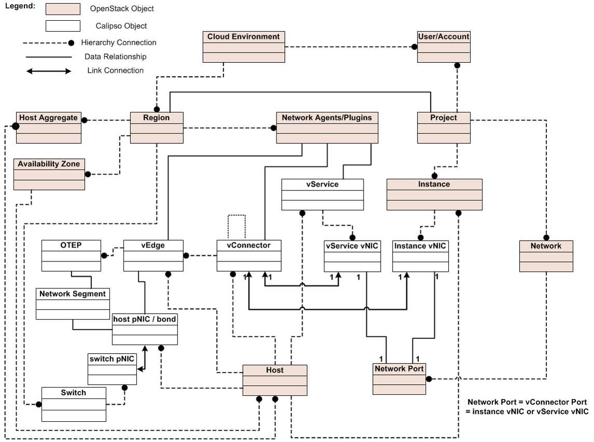

###############################################################################
# Copyright (c) 2017 Koren Lev (Cisco Systems), Yaron Yogev (Cisco Systems)   #
# and others                                                                  #
#                                                                             #
# All rights reserved. This program and the accompanying materials            #
# are made available under the terms of the Apache License, Version 2.0       #
# which accompanies this distribution, and is available at                    #
# http://www.apache.org/licenses/LICENSE-2.0                                  #
###############################################################################
| Calipso.io
| Objects Model

|image0|

Project “Calipso” tries to illuminate complex virtual networking with
real time operational state visibility for large and highly distributed
Virtual Infrastructure Management (VIM).

Calipso provides visible insights using smart discovery and virtual
topological representation in graphs, with monitoring per object in the
graph inventory to reduce error vectors and troubleshooting, maintenance
cycles for VIM operators and administrators.

Calipso model, described in this document, was *built for
multi-environment and many VIM variances*, the model was tested
successfully (as of Aug 27\ :sup:`th`) against 60 different VIM
variances (Distributions, Versions, Networking Drivers and Types).

Table of Contents

Calipso.io Objects Model 1

1 Environments config 4

2 Inventory objects 6

2.1 Host 6

2.2 physical NIC (pNIC) 7

2.3 Bond 7

2.4 Instance 7

2.5 virtual Service (vService) 7

2.6 Network 7

2.7 virtual NIC (vNIC) 7

2.8 Port 8

2.9 virtual Connector (vConnector) 8

2.10 virtual Edge (vEdge) 8

2.11 Overlay-Tunnel-Endpoint (OTEP) 8

2.12 Network\_segment 8

2.13 Network\_Agent 8

2.14 Looking up Calipso objects details 9

3 Link Objects 10

3.1 Link types 11

4 Clique objects 11

4.1 Clique types 11

5 Supported Environments 12

6 System collections 14

6.1 Attributes\_for\_hover\_on\_data 14

6.2 Clique\_constraints 14

6.3 Connection\_tests 14

6.4 Messages 14

6.5 Network\_agent\_types 14

6.6 Roles, Users 15

6.7 Statistics 15

6.8 Constants 15

6.9 Constants-env\_types 15

6.10 Constants-log\_levels 15

6.11 Constants-mechanism\_drivers 15

6.12 Constants-type\_drivers 15

6.13 Constants-environment\_monitoring\_types 15

6.14 Constants-link\_states 15

6.15 Constants-environment\_provision\_types 15

6.16 Constants-environment\_operational\_status 16

6.17 Constants-link\_types 16

6.18 Constants-monitoring\_sides 16

6.19 Constants-object\_types 16

6.20 Constants-scans\_statuses 16

6.21 Constants-distributions 16

6.22 Constants-distribution\_versions 16

6.23 Constants-message\_source\_systems 16

6.24 Constants-object\_types\_for\_links 16

6.25 Constants-scan\_object\_types 17

Environments config
===================

    Environment is defined as a certain type of Virtual Infrastructure
    facility the runs under a single unified Management (like an
    OpenStack facility).

    Everything in Calipso application rely on environments config, this
    is maintained in the **“environments\_config”** collection in the
    mongo Calipso DB.

    Environment configs are pushed down to Calipso DB either through UI
    or API (and only in OPNFV case Calipso provides an automated program
    to build all needed environments\_config parameters for an ‘Apex’
    distribution automatically).

    When scanning and discovering items Calipso uses this configuration
    document for successful scanning results, here is an example of an
    environment config document:

    **{ **

    **"name": "DEMO-ENVIRONMENT-SCHEME", **

    **"enable\_monitoring": true, **

    **"last\_scanned": "filled-by-scanning", **

    **"app\_path": "/home/scan/calipso\_prod/app", **

    **"type": "environment", **

    **"distribution": "Mirantis", **

    **"distribution\_version": "8.0”, **

    **"mechanism\_drivers": ["OVS”], **

    **"type\_drivers": "vxlan"**

    **"operational": "stopped", **

    **"listen": true, **

    **"scanned": false, **

    **"configuration": [**

    **{**

    **"name": "OpenStack", **

    **"port":”5000”, **

    **"user": "adminuser", **

    **"pwd": "dummy\_pwd", **

    **"host": "10.0.0.1", **

    **"admin\_token": "dummy\_token"**

    **}, **

    **{**

    **"name": "mysql", **

    **"pwd": "dummy\_pwd", **

    **"host": "10.0.0.1", **

    **"port": “3307”, **

    **"user": "mysqluser"**

    **}, **

    **{**

    **"name": "CLI", **

    **"user": "sshuser", **

    **"host": "10.0.0.1", **

    **"pwd": "dummy\_pwd"**

    **}, **

    **{**

    **"name": "AMQP", **

    **"pwd": "dummy\_pwd", **

    **"host": "10.0.0.1", **

    **"port": “5673”, **

    **"user": "rabbitmquser"**

    **}, **

    **{**

    **"name": "Monitoring", **

    **"ssh\_user": "root", **

    **"server\_ip": "10.0.0.1", **

    **"ssh\_password": "dummy\_pwd", **

    **"rabbitmq\_pass": "dummy\_pwd", **

    **"rabbitmq\_user": "sensu", **

    **"rabbitmq\_port": “5671”, **

    **"provision": "None", **

    **"env\_type": "production", **

    **"ssh\_port": “20022”, **

    **"config\_folder": "/local\_dir/sensu\_config", **

    **"server\_name": "sensu\_server", **

    **"type": "Sensu", **

    **"api\_port": NumberInt(4567)**

    **}, **

    **{**

    **"name": "ACI", **

    **"user": "admin", **

    **"host": "10.1.1.104", **

    **"pwd": "dummy\_pwd"**

    **}**

    **], **

    **"user": "wNLeBJxNDyw8G7Ssg", **

    **"auth": {**

    **"view-env": [**

    **"wNLeBJxNDyw8G7Ssg"**

    **], **

    **"edit-env": [**

    **"wNLeBJxNDyw8G7Ssg"**

    **]**

    **}, **

    **}**

    Here is a brief explanation of the purpose of major keys in this
    environment configuration doc:

    **Distribution**: captures type of VIM, used for scanning of
    objects, links and cliques.

    **Distribution\_version**: captures version of VIM distribution,
    used for scanning of objects, links and cliques.

    **Mechanism\_driver**: captures virtual switch type used by the VIM,
    used for scanning of objects, links and cliques.

    **Type\_driver**: captures virtual switch tunneling type used by the
    switch, used for scanning of objects, links and cliques.

    **Listen**: defines whether or not to use Calipso listener against
    the VIM BUS for updating inventory in real-time from VIM events.

    **Scanned**: defines whether or not Calipso ran a full and a
    successful scan against this environment.

    **Last\_scanned**: end time of last scan.

    **Operational**: defines whether or not VIM environment endpoints
    are up and running.

    **Enable\_monitoring**: defines whether or not Calipso should deploy
    monitoring of the inventory objects running inside all environment
    hosts.

    **Configuration-OpenStack**: defines credentials for OpenStack API
    endpoints access.

    **Configuration-mysql**: defines credentials for OpenStack DB
    access.

    **Configuration-CLI**: defines credentials for servers CLI access.

    **Configuration-AMQP**: defines credentials for OpenStack BUS
    access.

    **Configuration-Monitoring**: defines credentials and setup for
    Calipso sensu server (see monitoring-guide for details).

    **Configuration-ACI**: defines credentials for ACI switched
    management API, if exists.

    **User and auth**: used for UI authorizations to view and edit this
    environment.

    **App-path**: defines the root directory of the scanning
    application.

Inventory objects
=================

    Calipso’s success in scanning, discovering and analyzing many (60 as
    of 27\ :sup:`th` Aug 2017) variances of virtual infrastructures lies
    with its objects model and relationship definitions (model was
    tested even against a vSphere VMware environment).

    Those objects are the real-time processes and systems that are built
    by workers and agents on the virtual infrastructure servers.

    All Calipso objects are maintained in the **“inventory”**
    collection.

    Here are the major objects defined in Calipso inventory in order to
    capture the real-time state of networking:

Host
----

    It’s the physical server that runs all virtual objects, typically a
    hypervisor or a containers hosting machine.

    It’s typically a bare-metal server, in some cases it might be
    virtual (running “nesting” VMs as second virtualization layer inside
    it).

physical NIC (pNIC)
-------------------

    It’s the physical Ethernet Network Interface Card attached to the
    Host, typically several of those are available on a host, in some
    cases few of those are grouped (bundled) together into etherchannel
    bond interfaces.

    For capturing data from real infrastructure devices Calipso created
    2 types of pNICs: host\_pnic (pNICs on the servers) and switch\_pnic
    (pNICs on the physical switches). Calipso currently discovers host
    to switch physical connections only in some types of switches (Cisco
    ACI as of Aug 27\ :sup:`th` 2017).

Bond
----

    It’s a logical Network Interface using etherchannel standard
    protovcols to form a group of pNICs providing enhanced throughput
    for communications to/from the host.

    Calipso currently maintains bond details inside a host\_pnic object.

Instance
--------

    It’s the virtual server created for running a certain application or
    function. Typically it’s a Virtual Machine, sometimes it’s a
    Container.

virtual Service (vService)
--------------------------

    It’s a process/system that provides some type of networking service
    to instances running on networks, some might be deployed as
    namespaces and some might deploy as VM or Container, for example:
    DHCP server, Router, Firewall, Load-Balancer, VPN service and
    others. Calipso categorized vServices accordingly.

Network
-------

    It’s an abstracted object, illustrating and representing all the
    components (see below) that builds and provides communication
    services for several instances and vServices.

virtual NIC (vNIC)
------------------

    There are 2 types - instance vNIC and vService vNIC:

-  Instance vNIC: It’s the virtual Network Interface Card attached to
   the Instance and used by it for communications from/to that instance.

-  vService vNIC: It’s the virtual Network Interface Card attached to
   the vService used by it for communications from/to that vService.

Port
----

    It’s an abstracted object representing the attachment point for an
    instance or a vService into the network, in reality it’s fulfilled
    by deployment of vNICs on hosts.

virtual Connector (vConnector)
------------------------------

    It’s a process/system that provides layer 2 isolation for a specific
    network inside the host (isolating traffic from other networks).
    Examples: Linux Bridge, Bridge-group, port-group etc.

virtual Edge (vEdge)
--------------------

    It’s a process/system that provides switching and routing services
    for instances and/or vServices running on a specific host. It
    function as an edge device between virtual components running on
    that host and the pNICs on that host, making sure traffic is
    maintained and still isolated across different networks.

    Examples: Open Virtual Switch, Midonet, VPP.

Overlay-Tunnel-Endpoint (OTEP)
------------------------------

    It’s an abstracted object representing the end-point on the host
    that runs a certain tunneling technology to provide isolation across
    networks and hosts for packets leaving and entering the pNICs of a
    specific host. Examples: VXLAN tunnels endpoints, GRE tunnels
    endpoints etc.

Network\_segment
----------------

    It’s the specific segment used inside the “overlay tunnel” to
    represent traffic from a specific network, this depends on the
    specific type (encapsulation) of the OTEP.

    Calipso currently maintains segments details inside a network
    object.

Network\_Agent
--------------

    It’s a controlling software running on the hosts for orchestrating
    the lifecycle of the above virtual components. Examples: DHCP agent,
    L3 agent, OVS agent, Metadata agent etc.

Looking up Calipso objects details
----------------------------------

    As explained in more details in Calipso admin-guide, the underlying
    database used is mongoDB. All major objects discovered by Calipso
    scanning module are maintained in the “inventory” collection and
    those document includes detailed attributes captured from the
    infrastructure about those objects, here are the main objects
    quarries to use for grabbing each of the above object types from
    Calipso’s inventory:

    **{type:"vnic"}**

    **{type:"vservice"}**

    **{type:"instance"}**

    **{type:"host\_pnic"}**

    **{type:"switch\_pnic"}**

    **{type:"vconnector"}**

    **{type:"vedge"}**

    **{type:"network"}**

    **{type:"network\_agent"}**

    **{type:"otep"}**

    **{type:"host"}**

    **{type:"port"}**

    All Calipso modules (visualization, monitoring and analysis) rely on
    those objects as baseline inventory items for any further
    computation.

    Here is an example of a query made using mongo Chef Client
    application:

    |image1|

    \* See Calipso API-guide for details on looking up those objects
    through the Calipso API.

    The following simplified UML illustrates the way Calipso objects
    relationships are maintained in a VIM of type OpenStack:

|image2|

Link Objects
============

    Calipso analyzes all objects in its inventory for relationships,
    finding in real-time, which object is attached to which object and
    then creates a link object representing this relationship. This
    analysis finds a link that is “single hop away” - a connection from
    certain object to certain object that is attached to it directly.

    Derived relationships (A to B and B to C = A to C) is maintained as
    ‘cliques’.

    Links objects are maintained in the **“links”** collection.

Link types
----------

    Based on the specific VIM distribution, distribution version,
    mechanism driver and type driver a set of links are discovered
    automatically by Calipso scanning module. Each link type is
    bi-directional, it means that if a connection is discovered from A
    to B, a connection also exists from B to A.

    Here is the list of link types that might be discovered from a
    certain environment in the current release:

    **{"link\_type": "instance-vnic"}**

    **{"link\_type": "vnic-vconnector"}**

    **{"link\_type": "vconnector-vedge"}**

    **{"link\_type": "vedge-host\_pnic"}**

    **{"link\_type: "host\_pnic-network"}**

    **{"link\_type": "vedge-otep"}**

    **{"link\_type": "otep-vconnector"}**

    **{"link\_type": "otep-host\_pnic"}**

    **{"link\_type": "vconnector-host\_pnic"}**

    **{"link\_type": "vnic-vedge"}**

    **{"link\_type": "vservice-vnic"}**

    **{"link\_type": "switch\_pnic-host\_pnic"}**

    **{"link\_type": "switch\_pnic-switch\_pnic"}**

    **{"link\_type": "switch\_pnic-switch"}**

    A successful completion of scanning and discovery means that all
    inventory objects, link objects and clique objects (see below) are
    found and accurately representing real-time state of the virtual
    networking on the specific environment.

Clique objects
==============

    Cliques are lists of links. Clique represent a certain path in the
    virtual networking infrastructure that an administrator is
    interested in, this is made to allow easier searching and finding of
    certain points of interest (“focal point”).

Clique types
------------

    Based on the specific VIM distribution, distribution version,
    mechanism driver and type driver variance, Calipso scanning module
    search for specific cliques using a model that is pre-populated in
    its **“clique\_types”** collection, and it depends on the
    environment variance, here is an example of a clique\_type:

    **{ **

    **"environment" : "Apex-Euphrates", **

    **"link\_types" : [**

    **"instance-vnic", **

    **"vnic-vconnector", **

    **"vconnector-vedge", **

    **"vedge-otep", **

    **"otep-host\_pnic", **

    **"host\_pnic-network"**

    **], **

    **"name": "instance\_clique\_for\_opnfv", **

    **"focal\_point\_type": "instance"**

    **}**

    The above model instruct the Calipso scanner to create cliques with
    the above list of link types for a “focal\_point” that is an
    “instance” type of object. We believe this is a highly customized
    model for analysis of dependencies for many use cases. We have
    included several clique types, common across variances supported in
    this release.

    The cliques themselves are then maintained in the **“cliques**\ ”
    collection.

    To clarify this concept, here is an example for an implementation
    use case in the Calipso UI module:

    When the user of the UI clicks on a certain object of type=instance,
    he expresses he’s wish to see a graph representing the path taken by
    traffic from that specific instance (as the root source of traffic,
    on that specific network) all the way down to the host pNIC and the
    (abstracted) network itself.

    A successful completion of scanning and discovery means that all
    inventory objects, link objects and clique objects (based on the
    environment clique types) are found and accurately representing
    real-time state of the virtual networking on the specific
    environment.

Supported Environments
======================

    As of Aug 27\ :sup:`th` 2017, Calipso application supports 60
    different VIM environment variances and with each release the
    purpose of the application is to maintain support and add more
    variances per the VIM development cycles. The latest supported
    variance and the specific functions of Calipso available for that
    specific variance is captured in the **“supported\_environments”**
    collection, here are two examples of that ‘supported’ model:

    **1.**

    **{ **

    **"environment" : {**

    **"distribution" : "Apex", **

    **"distribution\_version" : ["Euphrates"], **

    **"mechanism\_drivers" : "OVS", **

    **"type\_drivers" : "vxlan"**

    **}, **

    **"features" : {**

    **"listening" : true, **

    **"scanning" : true, **

    **"monitoring" : false**

    **}**

    **}**

    **2.**

    **{ **

    **"environment" : {**

    **"distribution" : "Mirantis", **

    **"distribution\_version": ["6.0", "7.0", "8.0", "9.0", "9.1",
    "10.0"], **

    **"mechanism\_drivers" : "OVS", **

    **"type\_drivers" : "vxlan"**

    **}, **

    **"features" : {**

    **"listening" : true, **

    **"scanning" : true, **

    **"monitoring" : true**

    **}**

    **}**

    The examples above defines for Calipso application that:

1. For an ‘Apex’ environment of version ‘Euphrates’ using OVS and vxlan,
   Calipso can scan/discover all details (objects, links, cliques) but
   is not yet monitoring those discovered objects.

2. For a “Mirantis” environment of versions 6.0 to 10.0 using OVS and
   vxlan, Calipso can scan/discover all details (objects, links,
   cliques) and also monitor those discovered objects.

With each calipso release more “supported\_environments” should be
added.

System collections
==================

Calipso uses other system collections to maintain its data for scanning,
event handling, monitoring and for helping to operate the API and UI
modules, here is the recent list of collections not covered yet in other
written guides:

Attributes\_for\_hover\_on\_data
--------------------------------

This collection maintains a list of documents describing what will be
presented on the UI popup screen when the use hover-on a specific object
type, it details which parameters or attributed from the object’s data
will be shown on the screen, making this popup fully customized.

Clique\_constraints
-------------------

Defines the logic on which cliques are built, currently network is the
main focus of the UI (central point of connection for all cliques in the
system), but this is customizable.

When building a clique graph, Calipso defaults to traversing all nodes
edges (links) in the graph.

In some cases we want to limit the graph so it will not expand too much
(nor forever).

For example: when we build the graph for a specific instance, we limit
the graph to only take objects from the network on which this instance
resides - otherwise the graph will show objects related to other
instances.

The constraint validation is done by checking value V from the focal
point F on the links.

For example, if an n instance has network X, we check that each link we
use either has network X (attribute “network” has value X), or does not
have the “network” attribute.

Connection\_tests
-----------------

This collection keeps requests from the UI or API to test the different adapters (API, DB, and CLI etc) 
and their connections to the underlying VIM, making sure dynamic and real-time data will be maintained during discovery.

Messages
--------

Aggregates all loggings from the different systems, source\_system of
logs currently defined as “OpenStack” (the VIM), “Sensu” (the Monitoring
module) and “Calipso” (logs of the application itself. Messages have 6
levels of severity and can be browsed in the UI and through Calipso API.

Network\_agent\_types
---------------------

Lists the types of networking agents supported on the VIM (per
distribution and version).

Roles, Users
------------

Basic RBAC facility to authorize calispo UI users for certain calipso
functionalities on the UI.

Statistics
----------

Built for detailed analysis and future functionalities, used today for
traffic analysis (capturing samples of throughputs per session on VPP
based environments).

Constants
---------

This is an aggregated collection for many types of documents that are
required mostly by the UI and basic functionality on some scanning
classes (‘fetchers’).

Constants-env\_types
--------------------

Type of environments to allow for configuration on sensu monitoring
framework.

Constants-log\_levels
---------------------

Severity levels for messages generated.

Constants-mechanism\_drivers
----------------------------

Mechanism-drivers allowed for UI users.

Constants-type\_drivers
-----------------------

Type-drivers allowed for UI users.

Constants-environment\_monitoring\_types
----------------------------------------

Currently only “Sensu” is available, might be used for other monitoring
systems integrations.

Constants-link\_states
----------------------

Provides statuses for link objects, based on monitoring results.

Constants-environment\_provision\_types
---------------------------------------

The types of deployment options available for monitoring (see
monitoring-guide for details).

Constants-environment\_operational\_status
------------------------------------------

Captures the overall (aggregated) status of a curtained environment.

Constants-link\_types
---------------------

Lists the connections and relationships options for objects in the
inventory.

Constants-monitoring\_sides
---------------------------

Used for monitoring auto configurations of clients and servers.

Constants-object\_types
-----------------------

Lists the type of objects supported through scanning (inventory
objects).

Constants-scans\_statuses
-------------------------

During scans, several statuses are shown on the UI, based on the
specific stage and results.

Constants-distributions
-----------------------

Lists the VIM distributions.

Constants-distribution\_versions
--------------------------------

Lists the VIM different versions of different distributions.

Constants-message\_source\_systems
----------------------------------

The list of systems that can generate logs and messages.

Constants-object\_types\_for\_links
-----------------------------------

Object\_types used only for link popups on UI.

Constants-scan\_object\_types
-----------------------------

Object\_types used during scanning, see development-guide for details.

Constants-configuration_targets
Names of the configuration targets used in the configuration section of environment configs.

.. |image0| image:: media/image1.png
   :width: 6.50000in
   :height: 4.27153in

