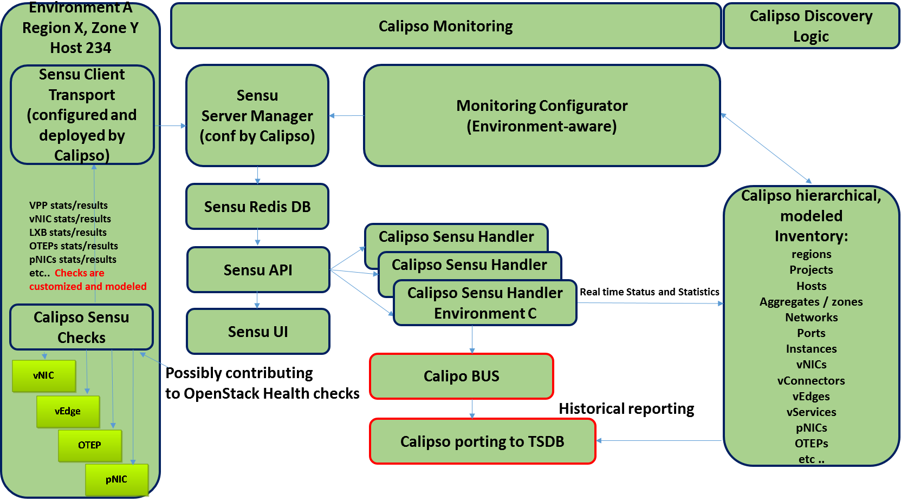

| Calipso.io
| Monitoring Guide

Copyright (c) 2017 Koren Lev (Cisco Systems), Yaron Yogev (Cisco Systems) and others                                                                
All rights reserved. This program and the accompanying materials           
are made available under the terms of the Apache License, Version 2.0       
which accompanies this distribution, and is available at                    
http://www.apache.org/licenses/LICENSE-2.0

|image0|

Project “Calipso” tries to illuminate complex virtual networking with
real time operational state visibility for large and highly distributed
Virtual Infrastructure Management (VIM).

We believe that Stability is driven by accurate Visibility.

Calipso provides visible insights using smart discovery and virtual
topological representation in graphs, with monitoring per object in the
graph inventory to reduce error vectors and troubleshooting, maintenance
cycles for VIM operators and administrators.

Table of Contents

Calipso.io Monitoring Guide 1

1 Monitoring deployment options 3

1.1 Calipso monitoring provisioning 3

1.2 Calipso-sensu container 5

2 Monitoring configurations 5

2.1 Calipso monitoring configuration templates 6

2.2 Calipso Apex monitoring integration 11

Monitoring deployment options 
==============================

    Calipso uses sensu framework that includes a customized calipso
    sensu server and a set of customized clients, for details on the
    framework see:

    https://sensuapp.org/docs/latest/overview/what-is-sensu.html

    Calipso uses this framework but further configure and customizes the
    install, per:

    https://sensuapp.org/docs/1.0/installation/

    Server and clients are deployed with rabbitmq over SSL as the
    client-server transport:

    https://sensuapp.org/docs/1.0/reference/ssl.html

    Calipso then deploys customized checks and handlers as new types of
    plugins:

    http://sensu-plugins.io/plugins/

    In order to monitor all virtual components as described in
    Calipso-model document, Calipso offers two major functions:

1. Calipso scan module: customizes and automatically deploys sensu,
   config files and all needed plugins and scripts on all clients and
   the central server.

2. Calipso sensu module: listens for the results of the customized
   events and updates the inventories with state and statuses, while
   generating all related messages.

Calipso monitoring provisioning
-------------------------------

    Calipso administrator should instruct the main scanning engine
    whether or not to deploy monitoring across the VIM environment
    hosts. This is done first by the Calipso scan container that uses a
    set of “environment\_config” parameters (see calipso-model guide for
    details).

    A full scan of an environment is a mandatory pre-requisite for
    monitoring, because calipso monitoring provisioning uses inventory
    discovered data as values of several configuration items to be
    deployed onto the sensu framework.

    Here are the important parts of an “environment\_config” document
    that needs to be defined either through UI or API as a pre-requisite
    for monitoring provisioning:

    {

    **"enable\_monitoring": true**, // this must be “true” for any
    monitoring result

    **"name"** **: "my-env-with-monitoring",** // name is needed as
    usual

    **"distribution" :** // other details removed ….

    **"configuration" : [** // in configuration: a monitoring section is
    defined

    **{**

    **"name" : "Monitoring",** // name of this configuration section

    **"type" : "Sensu",** // instruct to use a sensu type of monitoring
    framework

    **"rabbitmq\_port" : 5671,** // the SSL port used by sensu clients
    to server

    **"rabbitmq\_pass" : "dummy\_pwd",** // clients-to-server rabbitmq
    password

    **"rabbitmq\_user" : "sensu",** // clients-to-server rabbitmq
    username

    **"server\_ip" : "10.0.0.1",** // the calipso sensu container ip
    address

    **"ssh\_user": "root",** // user used inside the sensu server
    (container)

    **"ssh\_password": "dummy\_pwd",** // root pwd used inside the sensu
    server

    **"ssh\_port" : 20022, //** ssh port where sensu container offers
    ssh access

    **"server\_name”: "sensu\_server", /**/ name to use for the sensu
    server api

    **"env\_type" : "production",** // a type of environment to setup
    (sensu’s ‘type’)

    **"config\_folder" : "/local\_dir/sensu\_config",** // location to
    place config files

    **"api\_port" : 4567** // sensu server api port to connect to

    **"provision" : "None" // \*\* see provision options described next
    ! \*\***

    **}, **

    **]**

    \*\* **Provision** options are:

1. **“None”:** does not deploy any monitoring configurations

2. **“DB”:** creates all necessary configuration files in the mongoDB,
   placed in “monitoring\_config” collection.

3. **“Files”:** creates all necessary configuration files in the
   mongoDB, placed in “monitoring\_config” collection and also in
   ‘config\_folder’ location on the server.

4. **“Deploy”:** Does what “Files” is doing, but also goes and deploys
   all configuration files and scripts on all servers on the
   environment.

    *This is a high level representation of the calipso monitoring
    provisioning logic:*

    |image1|

Calipso-sensu container
-----------------------

    Once sensu clients and all needed configurations and plugins are
    deployed properly, the sensu server should start receiving results
    and update the relevant inventory objects with their states and
    statuses.

    The calipso-sensu container is a pre-built sensu server customized
    for calipso design.

    The following services are exposed on the calipso-sensu container:

1. Calipso monitoring handling app running in:
   /home/scan/calipso\_prod/app/monitoring/handlers/monitor.py

2. Sensu-api service accessible on port 4567.

3. Calipso container bash access through ssh on port 20022 (see
   quickstart-guide).

4. Sensu-server service listening as rabbitmq over ssl on port 5671.

5. Rabbitmq management server on port 15672 (http://server-ip:15672/ to
   access).

6. Sensu uchiwa UI listening on port 3000 (http://server-ip:3000 to
   access).

    All the above services are maintained by calipso and customized for
    calipso’s virtual inventory monitoring design.

Monitoring configurations 
==========================

    You can access calipso-sensus container by ssh, using:

    **ssh scan@localhost -p 20022** with a default password “scan”.

    Inside the calipso-sensu container the calipso monitoring
    application is maintained at:

    **/home/scan/calipso\_prod/app/monitoring**

    SSL keys are shipped with the calipso-sensu container and maintained
    at:

    **/etc/sensu/ssl **

    Check scripts used to run a health check against monitored objects
    are maintained at:

    **/home/scan/calipso\_prod/app/monitoring/checks**

    Handling scripts to grab and handle checks results from clients are
    maintained at:

    **/home/scan/calipso\_prod/app/monitoring/handlers**

    Configuration deployment setup scripts are maintained at:

    **/home/scan/calipso\_prod/app/monitoring/setup**

Calipso monitoring configuration templates
------------------------------------------

    Calipso application maintained a customizable model for all the
    configuration files deployed onto the sensu server and clients at
    provisioning stage of its main scanning engine.

    The following configuration files are customizable:

    *Server side:*

    **redis.json**

    **transport,json**

    **rabbitmq.json**

    **api.json**

    **client.json**

    **filters.json**

    **handlers.json**

    *Clients side:*

    **transport,json**

    **rabbitmq.json**

    **client.json**

    **customized checks to integrate into client.json **

    We have defined a default set of configuration parameters in those
    files per our knowledge and best practices, so a typical user would
    not need to edit any of the above set of configuration files and
    their options. In case any of these needs customizations we offer a
    very granular model maintained in Calipso mongoDB under the
    **“monitoring\_config\_templates”** collection.

    Here is an example of such template, and its options:

    **"type" : "client.json",** // this will be used for building
    client.json files

    **"order" : "1",** // if several of these templates are configured,
    take a priority to use

    **"side" : "client", //**\ client.json file deployed onto the client
    side (env hosts)

    **"config" : {** // the actual configuration txt follows …

    **"client" : {**

    **"address" : "{client\_name}",** // take the name of host from scan
    inventory

    **"subscriptions" : [** //a future option

    **], **

    **"environment" : "{env\_name}",** // name of the VIM environment
    for logs

    **"name" : "{client\_name}" //** take the name of host from scan
    inventory

    **}, **

    **"api" : {**

    **"host" : "{server\_ip}", //** take the server\_ip of
    environment\_config

    **"port" : NumberInt(4567)** // use this port for interfacing with
    the server

    **}**

    **}, **

    **"monitoring\_system" : "sensu"**

    **}**

    The above is just a simple example, login to mongoDB and check
    “monitoring\_config\_templates” collection for recent information on
    deployment files and their configuration options.

    The results of the monitoring provisioning are placed, by default,
    in mongoDB at the collection – “\ **monitoring\_config**\ ”, locally
    on the calipso-scan container at **/local\_dir/sensu\_config** and
    finally on the server (calipso-sensu container) and on all the hosts
    (clients). Here is an example of the resulted client.json file on
    one of the environment hosts (example deployment from real VIM
    environment):

    **{**

    **"api": {**

    **"host": "korlev-calipso-dev.cisco.com",**

    **"port": 4567**

    **},**

    **"checks": {**

    **"host\_pnic\_eno16777728-00---..58..---50---..58..---56---..58..---ac---..58..---e8---..58..---97":
    {**

    **"command": "check\_pnic\_ovs.py eno16777728",**

    **"handlers": [**

    **"file",**

    **"osdna-monitor"**

    **],**

    **"interval": 15,**

    **"standalone": true,**

    **"subscribers": [**

    **"base"**

    **],**

    **"type": "metric"**

    **},**

    **"host\_pnic\_eno33554952-00---..58..---50---..58..---56---..58..---ac---..58..---c9---..58..---a2":
    {**

    **"command": "check\_pnic\_ovs.py eno33554952",**

    **"handlers": [**

    **"file",**

    **"osdna-monitor"**

    **],**

    **"interval": 15,**

    **"standalone": true,**

    **"subscribers": [**

    **"base"**

    **],**

    **"type": "metric"**

    **},**

    **"otep\_node-6.cisco.com-otep\_vxlan-c0a80201": {**

    **"command": "check\_ping.py -c 10 -i 0.5 -p 4f532d444e41 -w 10 -s
    256 -f 192.168.2.2 -t 192.168.2.1 -W 1%/301.11/600 -C
    10%/1020.12/2000",**

    **"handlers": [**

    **"default",**

    **"file",**

    **"osdna-monitor"**

    **],**

    **"interval": 15,**

    **"standalone": true,**

    **"subscribers": [**

    **"base"**

    **],**

    **"type": "metric"**

    **},**

    **"otep\_node-6.cisco.com-otep\_vxlan-c0a80203": {**

    **"command": "check\_ping.py -c 10 -i 0.5 -p 4f532d444e41 -w 10 -s
    256 -f 192.168.2.2 -t 192.168.2.3 -W 1%/301.11/600 -C
    10%/1020.12/2000",**

    **"handlers": [**

    **"default",**

    **"file",**

    **"osdna-monitor"**

    **],**

    **"interval": 15,**

    **"standalone": true,**

    **"subscribers": [**

    **"base"**

    **],**

    **"type": "metric"**

    **},**

    **"vedge\_bc865c43-3dc5-4940-af1d-b4be59df1bd0": {**

    **"command": "check\_vedge\_ovs.py",**

    **"handlers": [**

    **"default",**

    **"file",**

    **"osdna-monitor"**

    **],**

    **"interval": 15,**

    **"standalone": true,**

    **"subscribers": [**

    **"base"**

    **],**

    **"type": "metric"**

    **},**

    **"vservice\_qdhcp-6c5ddc76-fcd7-4bdd-bff4-1d08b88b96ca": {**

    **"command": "PYTHONPATH=/etc/sensu/plugins check\_vservice.py dhcp
    qdhcp-6c5ddc76-fcd7-4bdd-bff4-1d08b88b96ca",**

    **"handlers": [**

    **"default",**

    **"file",**

    **"osdna-monitor"**

    **],**

    **"interval": 15,**

    **"standalone": true,**

    **"subscribers": [**

    **"base"**

    **],**

    **"type": "metric"**

    **},**

    **"vservice\_qdhcp-721f9c95-3042-4840-b8a4-83968c1e92b6": {**

    **"command": "PYTHONPATH=/etc/sensu/plugins check\_vservice.py dhcp
    qdhcp-721f9c95-3042-4840-b8a4-83968c1e92b6",**

    **"handlers": [**

    **"default",**

    **"file",**

    **"osdna-monitor"**

    **],**

    **"interval": 15,**

    **"standalone": true,**

    **"subscribers": [**

    **"base"**

    **],**

    **"type": "metric"**

    **},**

    **"vservice\_qdhcp-cc7ea40b-bb11-4b51-8e51-1a3b7abd283d": {**

    **"command": "PYTHONPATH=/etc/sensu/plugins check\_vservice.py dhcp
    qdhcp-cc7ea40b-bb11-4b51-8e51-1a3b7abd283d",**

    **"handlers": [**

    **"default",**

    **"file",**

    **"osdna-monitor"**

    **],**

    **"interval": 15,**

    **"standalone": true,**

    **"subscribers": [**

    **"base"**

    **],**

    **"type": "metric"**

    **},**

    **"vservice\_qrouter-1833846f-573e-45ef-8c87-3f7df530cdbd": {**

    **"command": "PYTHONPATH=/etc/sensu/plugins check\_vservice.py
    router qrouter-1833846f-573e-45ef-8c87-3f7df530cdbd",**

    **"handlers": [**

    **"default",**

    **"file",**

    **"osdna-monitor"**

    **],**

    **"interval": 15,**

    **"standalone": true,**

    **"subscribers": [**

    **"base"**

    **],**

    **"type": "metric"**

    **}**

    **},**

    **"client": {**

    **"address": "Mirantis-Liberty-node-6.cisco.com",**

    **"environment": "Mirantis-Liberty",**

    **"name": "Mirantis-Liberty-node-6.cisco.com",**

    **"subscriptions": []**

    **}**

    **}**

    All sensu configuration files, keys and scripts are eventually
    deployed, both on clients and on server side at the following
    locations:

    *SSL keys:* **/etc/sensu/ssl**

    *Calipso monitoring checks*: **/etc/sensu/plugins **

    *Configuration files:* **/etc/sensu/conf.d **

    The calipso-scan container is in-charge of the actual deployment (in
    case environment\_config is configured with needed details and
    “provision” = “Deploy.

    Calipso-scan then uses the calipso-sensu as the target “sensu
    server” to deploy and all the environment pre-discovered hosts as
    “sensu clients” to deploy, all pointing their monitoring results
    back to the calipso-sensu container.

    Calipso-scan uses ssh to access all hosts (through the master-host,
    see admin-guide) and also to access calipso-sensu container on port
    20022 to upload all customized files and places them in the above
    locations.

Calipso Apex monitoring integration
-----------------------------------

    For OPNFV version ‘P’ of the calipso application, farther automation
    has been developed for ‘zero touch’ automation. Calipso has a
    built-in ‘apex-configurator’ that runs at apex install phase
    (current scenario: os-nosdn-calipso-noha) and deploys the sensu
    clients themselves with all needed configurations, per apex install
    parameters and customizes the calipso-sensu container accordingly…no
    manual UI or API steps are needed for end-to-end functionality.

.. |image0| image:: media/image1.png
   :width: 6.50000in
   :height: 4.27153in

