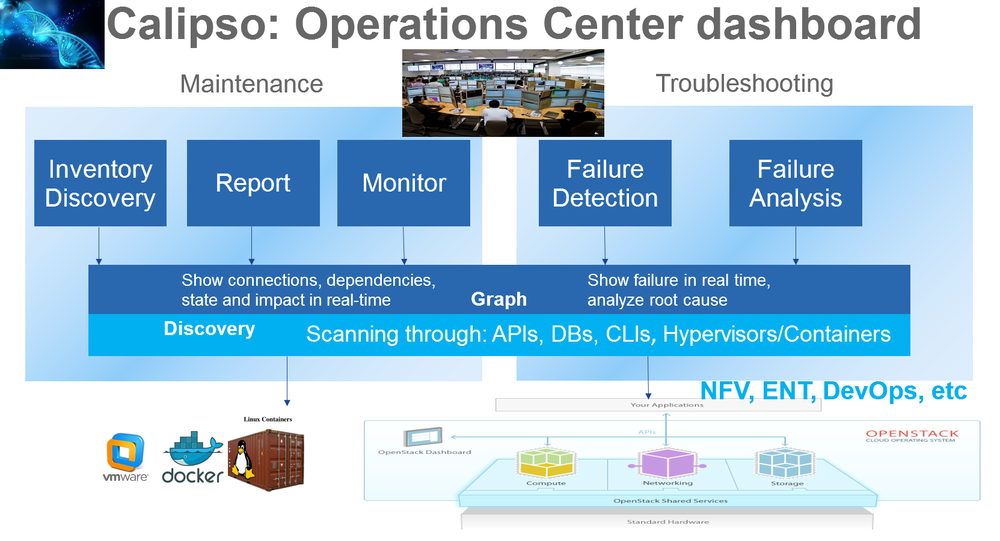
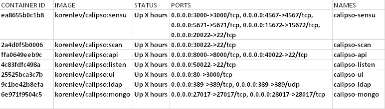
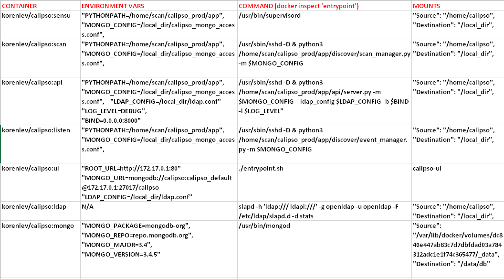
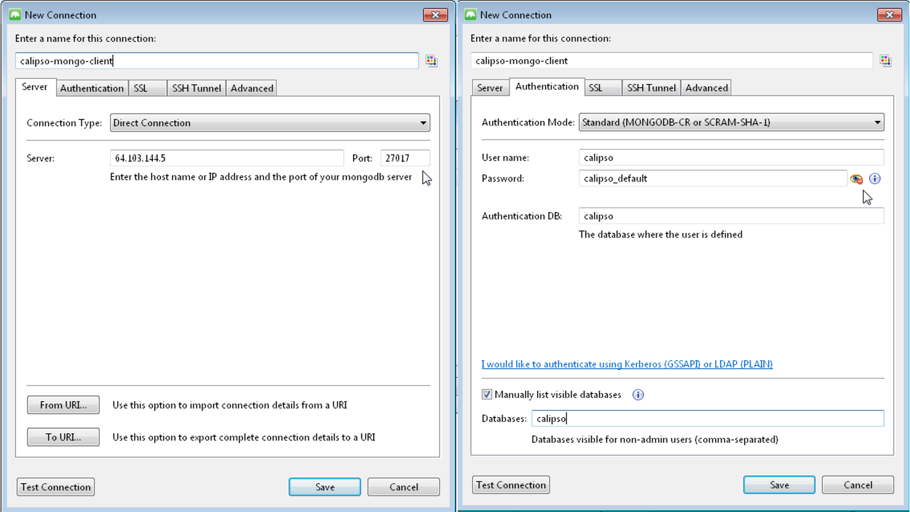
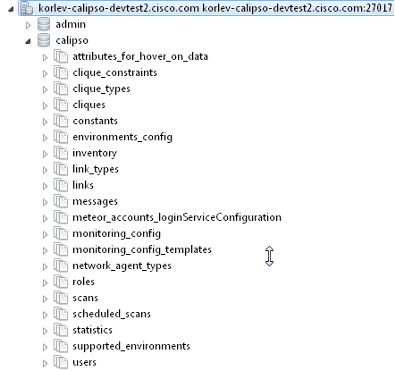
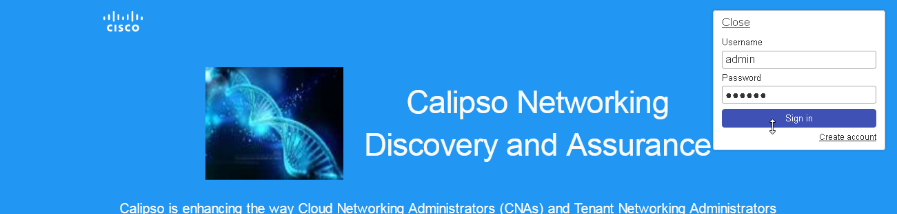

| Calipso.io
| Quick Start Guide

Copyright (c) 2017 Koren Lev (Cisco Systems), Yaron Yogev (Cisco Systems) and others                                                                
All rights reserved. This program and the accompanying materials           
are made available under the terms of the Apache License, Version 2.0       
which accompanies this distribution, and is available at                    
http://www.apache.org/licenses/LICENSE-2.0

|image0|

Project “Calipso” tries to illuminate complex virtual networking with
real time operational state visibility for large and highly distributed
Virtual Infrastructure Management (VIM).

We believe that Stability is driven by accurate Visibility.

Calipso provides visible insights using smart discovery and virtual
topological representation in graphs, with monitoring per object in the
graph inventory to reduce error vectors and troubleshooting, maintenance
cycles for VIM operators and administrators.

Table of Contents

Calipso.io Quick Start Guide 1

1 Getting started 3

1.1 Post installation tools 3

1.2 Calipso containers details 3

1.3 Calipso containers access 5

2 Validating Calipso app 5

2.1 Validating calipso-mongo module 5

2.2 Validating calipso-scan module 7

2.3 Validating calipso-listen module 8

2.4 Validating calipso-api module 9

2.5 Validating calipso-sensu module 9

2.6 Validating calipso-ui module 10

2.7 Validating calipso-ldap module 10

Getting started
===============

Post installation tools 
------------------------

    Calipso administrator should first complete installation as per
    install-guide document.

    After all calipso containers are running she can start examining the
    application using the following suggested tools:

1. MongoChef : https://studio3t.com/download/ as a useful GUI client to
   interact with calipso mongoDB module.

2. Web Browser to access calipso-UI at the default localtion:
   http://server-IP

3. SSH client to access other calipso containers as needed.

4. Python3 toolsets for debugging and development as needed.

Calipso containers details
--------------------------

    Calipso is currently made of the following 7 containers:

1. Mongo: holds and maintains calipso’s data inventories.

2. LDAP: holds and maintains calipso’s user directories.

3. Scan: deals with automatic discovery of virtual networking from VIMs.

4. Listen: deals with automatic updating of virtual networking into
   inventories.

5. API: runs calipso’s RESTful API server.

6. UI: runs calipso’s GUI/web server.

7. Sensu: runs calipso’s monitoring server.

    After successful installation Calipso containers should have been
    downloaded, registered and started, here are the images used:

    **sudo docker images**

    Expected results (as of Aug 2017):

    **REPOSITORY        TAG       IMAGE    ID CREATED     SIZE**

    **korenlev/calipso listen 12086aaedbc3 6 hours ago 1.05GB**

    **korenlev/calipso api 34c4c6c1b03e 6 hours ago 992MB**

    **korenlev/calipso scan 1ee60c4e61d5 6 hours ago 1.1GB**

    **korenlev/calipso sensu a8a17168197a 6 hours ago 1.65GB**

    **korenlev/calipso mongo 17f2d62f4445 22 hours ago 1.31GB**

    **korenlev/calipso ui ab37b366e812 11 days ago 270MB**

    **korenlev/calipso ldap 316bc94b25ad 2 months ago 269MB**

    Typically Calipso application is fully operational at this stage and
    you can jump to ‘Using Calipso’ section to learn how to use it, the
    following explains how the containers are deployed by
    calipso-installer.py for general reference.

    Checking the running containers status and ports in use:

    **sudo docker ps**

    Expected results and details (as of Aug 2017):

|image2|

    The above listed TCP ports are used by default on the hosts to map
    to each calipso container, you should be familiar with these
    mappings of ports per container.

    Checking running containers entry-points (The commands used inside
    the container):

    **sudo docker inspect [container-ID]**

    Expected results (as of Aug 2017):

|image3|

    Calipso containers configuration can be listed with **docker
    inspect**, summarized in the table above. In a none-containerized
    deployment (see ‘Monolithic app install option in the install-guide)
    these are the individual commands that are needed to run calipso
    manually for special development needs.

    The ‘calipso-sensu’ is built using sensu framework customized for
    calipso monitoring design, ‘calipso-ui’ is built using meteor
    framework, ‘calipso-ldap’ is built using pre-defined open-ldap
    container, and as such those three are only supported as pre-built
    containers.

    Administrator should be aware of the following details deployed in
    the containers:

1. calipso-api, calipso-sensu, calipso-scan and calipso-listen maps host
   directory **/home/calipso as volume /local\_dir** inside the
   container.

   They use **calipso\_mongo\_access.conf** and **ldap.conf** files for
   configuration.

   They use **/home/scan/calipso\_prod/app** as the main PYTHONPATH
   needed to run the different python modules per container.

2. Calipso-sensu is using the ‘supervisord’ process to control all sensu
   server processes needed for calipso and the calipso event handler on
   this container.

3. Calipso-ldap can be used as standalone, but is a pre-requisite for
   calipso-api.

4. Calipso-ui needs calipso-mongo with latest scheme, to run and offer
   UI services.

Calipso containers access
-------------------------

    The different Calipso containers are also accessible using SSH and
    pre-defined default credentials, here is the access details:

    Calipso-listen: ssh scan@localhost –p 50022 , password = scan

    Calipso-scan: ssh scan@localhost –p 30022 , password = scan

    Calipso-api: ssh scan@localhost –p 40022 , password = scan

    Calipso-sensu: ssh scan@localhost –p 20022 , password = scan

    Calipso-ui: only accessible through web browser

    Calipso-ldap: only accessible through ldap tools.

    Calipso-mongo: only accessible through mongo clients like MongoChef.

Validating Calipso app
======================

Validating calipso-mongo module
-------------------------------

    Using MongoChef client, create a new connection pointing to the
    server where calipso-mongo container is running, using port 27017
    and the following default credentials:

    Host IP=server\_IP and TCP port=27017

    Username : calipso

    Password : calipso\_default

    Auto-DB: calipso

    Defaults are also configured into
    /home/calipso/calipso\_mongo\_access.conf.

    The following is a screenshot of a correct connection setup in
    MongoChef:

    |image4|

    When clicking on the new defined connection the calipso DB should be
    listed:

    |image5|

    At this stage you can checkout calipso-mongo collections data and
    validate as needed.

Validating calipso-scan module
------------------------------

    Scan container is running the main calipso scanning engine that
    receives requests to scan a specific VIM environment, this command
    will validate that the main scan\_manager.py process is running and
    waiting for scan requests:

    **sudo docker ps** **# grab the containerID of calipso-scan**

    **sudo docker logs bf5f2020028a #containerID for example**

    Expected results:

    **2017-08-28 06:11:39,231 INFO: Using inventory collection:
    inventory**

    **2017-08-28 06:11:39,231 INFO: Using links collection: links**

    **2017-08-28 06:11:39,231 INFO: Using link\_types collection:
    link\_types**

    **2017-08-28 06:11:39,231 INFO: Using clique\_types collection:
    clique\_types**

    **2017-08-28 06:11:39,231 INFO: Using clique\_constraints
    collection: clique\_constraints**

    **2017-08-28 06:11:39,231 INFO: Using cliques collection: cliques**

    **2017-08-28 06:11:39,232 INFO: Using monitoring\_config collection:
    monitoring\_config**

    **2017-08-28 06:11:39,232 INFO: Using constants collection:
    constants**

    **2017-08-28 06:11:39,232 INFO: Using scans collection: scans**

    **2017-08-28 06:11:39,232 INFO: Using messages collection:
    messages**

    **2017-08-28 06:11:39,232 INFO: Using monitoring\_config\_templates
    collection: monitoring\_config\_templates**

    **2017-08-28 06:11:39,232 INFO: Using environments\_config
    collection: environments\_config**

    **2017-08-28 06:11:39,232 INFO: Using supported\_environments
    collection: supported\_environments**

    **2017-08-28 06:11:39,233 INFO: Started ScanManager with following
    configuration:**

    **Mongo config file path: /local\_dir/calipso\_mongo\_access.conf**

    **Scans collection: scans**

    **Environments collection: environments\_config**

    **Polling interval: 1 second(s)**

    The above logs basically shows that scan\_manager.py is running and
    listening to scan requests (should they come in through into ‘scans’
    collection for specific environment listed in ‘environments\_config’
    collection, refer to use-guide for details).

Validating calipso-listen module
--------------------------------

    Listen container is running the main calipso event\_manager engine
    that listens for events on a specific VIM BUS environment, this
    command will validate that the main event\_manager.py process is
    running and waiting for events from the BUS:

    **2017-08-28 06:11:35,572 INFO: Using inventory collection:
    inventory**

    **2017-08-28 06:11:35,572 INFO: Using links collection: links**

    **2017-08-28 06:11:35,572 INFO: Using link\_types collection:
    link\_types**

    **2017-08-28 06:11:35,572 INFO: Using clique\_types collection:
    clique\_types**

    **2017-08-28 06:11:35,572 INFO: Using clique\_constraints
    collection: clique\_constraints**

    **2017-08-28 06:11:35,573 INFO: Using cliques collection: cliques**

    **2017-08-28 06:11:35,573 INFO: Using monitoring\_config collection:
    monitoring\_config**

    **2017-08-28 06:11:35,573 INFO: Using constants collection:
    constants**

    **2017-08-28 06:11:35,573 INFO: Using scans collection: scans**

    **2017-08-28 06:11:35,573 INFO: Using messages collection:
    messages**

    **2017-08-28 06:11:35,573 INFO: Using monitoring\_config\_templates
    collection: monitoring\_config\_templates**

    **2017-08-28 06:11:35,573 INFO: Using environments\_config
    collection: environments\_config**

    **2017-08-28 06:11:35,574 INFO: Using supported\_environments
    collection: supported\_environments**

    **2017-08-28 06:11:35,574 INFO: Started EventManager with following
    configuration:**

    **Mongo config file path: /local\_dir/calipso\_mongo\_access.conf**

    **Collection: environments\_config**

    **Polling interval: 5 second(s)**

    The above logs basically shows that event\_manager.py is running and
    listening to event (should they come in through from VIM BUS) and
    listed in ‘environments\_config’ collection, refer to use-guide for
    details).

Validating calipso-api module
-----------------------------

    Scan container is running the main calipso API that allows
    applications to integrate with calipso inventory and functions, this
    command will validate it is operational:

    **sudo docker ps** **# grab the containerID of calipso-scan**

    **sudo docker logs bf5f2020028c #containerID for example**

    Expected results:

    **2017-08-28 06:11:38,118 INFO: Using inventory collection:
    inventory**

    **2017-08-28 06:11:38,119 INFO: Using links collection: links**

    **2017-08-28 06:11:38,119 INFO: Using link\_types collection:
    link\_types**

    **2017-08-28 06:11:38,119 INFO: Using clique\_types collection:
    clique\_types**

    **2017-08-28 06:11:38,120 INFO: Using clique\_constraints
    collection: clique\_constraints**

    **2017-08-28 06:11:38,120 INFO: Using cliques collection: cliques**

    **2017-08-28 06:11:38,121 INFO: Using monitoring\_config collection:
    monitoring\_config**

    **2017-08-28 06:11:38,121 INFO: Using constants collection:
    constants**

    **2017-08-28 06:11:38,121 INFO: Using scans collection: scans**

    **2017-08-28 06:11:38,121 INFO: Using messages collection:
    messages**

    **2017-08-28 06:11:38,121 INFO: Using monitoring\_config\_templates
    collection: monitoring\_config\_templates**

    **2017-08-28 06:11:38,122 INFO: Using environments\_config
    collection: environments\_config**

    **2017-08-28 06:11:38,122 INFO: Using supported\_environments
    collection: supported\_environments**

    **[2017-08-28 06:11:38 +0000] [6] [INFO] Starting gunicorn 19.4.5**

    **[2017-08-28 06:11:38 +0000] [6] [INFO] Listening at:
    http://0.0.0.0:8000 (6)**

    **[2017-08-28 06:11:38 +0000] [6] [INFO] Using worker: sync**

    **[2017-08-28 06:11:38 +0000] [12] [INFO] Booting worker with pid:
    12**

    The above logs basically shows that the calipso api is running and
    listening on port 8000 for requests.

Validating calipso-sensu module
-------------------------------

    Sensu container is running several servers (currently unified into
    one for simplicity) and the calipso event handler (refer to
    use-guide for details), here is how to validate it is operational:

    **ssh scan@localhost -p 20022 # default password = scan**

    **sudo /etc/init.d/sensu-client status**

    **sudo /etc/init.d/sensu-server status**

    **sudo /etc/init.d/sensu-api status**

    **sudo /etc/init.d/uchiwa status**

    **sudo /etc/init.d/rabbitmq-server status**

    Expected results:

    **Each of the above should return a pid and a ‘running’ state +**

    **ls /home/scan/calipso\_prod/app/monitoring/handlers # should list
    monitor.py module.**

    The above logs basically shows that calipso-sensu is running and
    listening to monitoring events from sensu-clients on VIM hosts,
    refer to use-guide for details).

Validating calipso-ui module
----------------------------

    UI container is running several JS process with the back-end
    mongoDB, it needs data to run and it will not run if any connection
    with DB is lost, this is per design. To validate operational state
    of the UI simply point a Web Browser to : http://server-IP:80 and
    expect a login page. Use admin/123456 as default credentials to
    login:

    |image6|

Validating calipso-ldap module
------------------------------

    LDAP container is running a common user directory for integration
    with UI and API modules, it is placed with calipso to validate
    interaction with LDAP. The main configuration needed for
    communication with it is stored by calipso installer in
    /home/calipso/ldap.conf and accessed by the API module. We assume in
    production use-cases a corporate LDAP server might be used instead,
    in that case ldap.conf needs to be changed and point to the
    corporate server.

    To validate LDAP container, you will need to install
    openldap-clients, using:

    **yum -y install openldap-clients / apt-get install
    openldap-clients**

    Search all LDAP users inside that ldap server:

    **ldapsearch -H ldap://localhost -LL -b ou=Users,dc=openstack,dc=org
    x**

    Admin user details on this container (user=admin, pass=password):

    **LDAP username : cn=admin,dc=openstack,dc=org**

    **cn=admin,dc=openstack,dc=org's password : password**

    **Account BaseDN [DC=168,DC=56,DC=153:49154]:
    ou=Users,dc=openstack,dc=org**

    **Group BaseDN [ou=Users,dc=openstack,dc=org]:**

    Add a new user (admin credentials needed to bind to ldap and add
    users):

    Create a **/tmp/adduser.ldif** file, use this example:

    **dn: cn=Myname,ou=Users,dc=openstack,dc=org // which org, which ou
    etc ...**

    **objectclass: inetOrgPerson**

    **cn: Myname // match the dn details !**

    **sn: Koren**

    **uid: korlev**

    **userpassword: mypassword // the password**

    **carlicense: MYCAR123**

    **homephone: 555-111-2222**

    **mail: korlev@cisco.com**

    **description: koren guy**

    **ou: calipso Department**

    Run this command to add the above user attributes into the ldap
    server:

    **ldapadd -x -D cn=admin,dc=openstack,dc=org -w password -c -f
    /tmp/adduser.ldif** // for example, the above file is used and the
    admin bind credentials who is, by default, authorized to add users.

    You should see **"user added"** message if successful

    Validate users against this LDAP container:

    Wrong credentials:

    **ldapwhoami -x -D cn=Koren,ou=Users,dc=openstack,dc=org -w
    korlevwrong**

    **Response: ldap\_bind: Invalid credentials (49)**

    Correct credentials:

    **ldapwhoami -x -D cn=Koren,ou=Users,dc=openstack,dc=org -w korlev**

    **Response: dn:cn=Koren,ou=Users,dc=openstack,dc=org**

    The reply ou/dc details can be used by any application (UI and API
    etc) for mapping users to some application specific group…

-  If all the above validations passed, Calipso is now fully functional,
   refer to admin-guide for more details.

.. |image0| image:: media/image1.png
   :width: 6.50000in
   :height: 4.27153in

